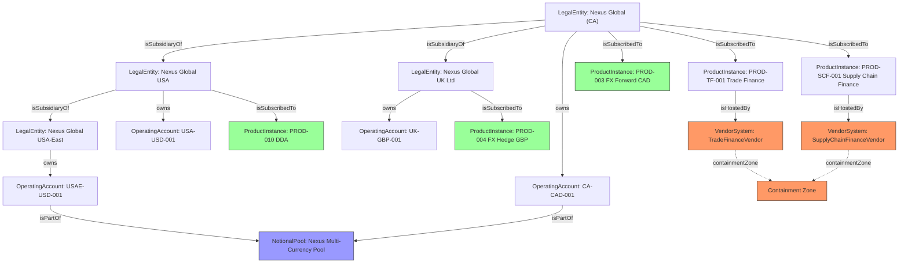

# Transaction Banking — Canonical Graph & Proof Registry
## Architecture Specification for Implementation

---

## 1. What We Are Building

A **temporally versioned, evidence-anchored knowledge graph** for Global Transaction Banking.

Two inseparable systems:

1. **The Canonical Graph** — every entity, product, account, transaction, and channel relationship that exists in GTB, modelled as nodes and edges
2. **The Proof Registry** — for every edge in the graph, an immutable, append-only record of the evidence that proves the relationship is true

The graph answers: *what is the current state of the world?*  
The Proof Registry answers: *why is it true, and how do we know?*

Neither is complete without the other. An edge with no proof chain is an unverified assertion. A proof record with no graph edge is an orphaned document.

### Core Architectural Rule

> Materialisation is always derived from the graph. The graph is never derived from the materialisation.

Operational databases (CB, CM, Wealth) are projections of the canonical graph. The graph is the source of truth. Databases are read-optimised views shaped by LOB exposure and organisational structure.

---

## 2. The Canonical Graph

### 2.1 Node Types

```
Node
├── Party
│   ├── LegalEntity
│   │   ├── Corporation
│   │   ├── Partnership
│   │   ├── Trust
│   │   └── Sovereign
│   ├── NaturalPerson
│   ├── FinancialInstitution
│   └── Regulator
├── EntityGroup
│   ├── UltimateParent
│   └── ConsolidatedGroup
├── Product
│   ├── ProductDefinition
│   ├── ProductInstance
│   └── ProductBundle
├── Account
│   ├── OperatingAccount
│   ├── VirtualAccount
│   ├── NotionalPool
│   ├── PhysicalPool
│   ├── TradingAccount
│   └── CustodyAccount
├── Transaction
│   ├── Payment
│   ├── TradeTransaction
│   ├── FXTransaction
│   ├── Fee
│   ├── InterestPosting
│   ├── SweepTransaction
│   └── Reversal
├── Channel
│   ├── DigitalPortal
│   ├── APIChannel
│   ├── H2HChannel
│   └── SWIFTChannel
├── Obligation
│   ├── RegulatoryObligation
│   ├── ContractualObligation
│   ├── CreditObligation
│   └── SettlementObligation
├── Mandate
│   ├── HumanMandate
│   └── AgentMandate
└── VendorSystem
    ├── TradeFinanceSystem
    └── SupplyChainFinanceSystem
```

### 2.1.1 Vendor-Hosted System Constraint

**Constraint `[VENDOR-HOSTED]`:** Most core GTB offerings are vendor-hosted systems, not homegrown bank applications. The ontology serves as a **semantic integration layer** over vendor schemas rather than a direct physical canonical store for all operational data.

Specifically for the Nexus Global reference client:

| Product Line | Hosting Model | Ontology Role |
|---|---|---|
| Cash Management | Bank-owned (Core) | Direct canonical representation |
| Liquidity (Pooling/Sweeps) | Bank-owned (Core) | Direct canonical representation |
| **Trade Finance** | **Vendor-hosted** | **Containment Zone → progressive mapping** |
| **Supply Chain Finance** | **Vendor-hosted** | **Containment Zone → progressive mapping** |

Vendor systems produce domain-level execution data (proprietary status codes, raw messages). The Containment Zone absorbs them as-is. Progressive mapping lifts signal upward through the ontology layers over time until it lands in Core ontology terms.

**Implication:** `VendorSystem` nodes carry a `containmentZone` flag. Edges from VendorSystem nodes to Core nodes are marked `mappingStatus: Partial | Complete` to track harmonization progress. This is an open constraint to be resolved during implementation (see §13).

**Reference client:** Nexus Global (see §14 for concrete mapping).

### 2.2 Node Schema (base)

Every node regardless of type carries:

```typescript
interface GraphNode {
  id: string                    // UUID v4
  type: NodeType                // enum from taxonomy above
  lei?: string                  // Legal Entity Identifier — universal join key where applicable
  canonicalName: string         // unambiguous display name
  aliases: string[]             // known alternate names across LOB systems
  createdAt: ISO8601            // when node was first asserted in graph
  createdBy: ActorRef           // who or what created it
  state: NodeState              // Active | Suspended | Terminated | Disputed
  domainExtensions: {           // LOB-specific properties — never override canonical fields
    cb?: Record<string, unknown>
    cm?: Record<string, unknown>
    wm?: Record<string, unknown>
  }
  proofChainId: string          // foreign key into Proof Registry
}
```

### 2.3 Edge Types

```
Edge
├── Ownership
│   ├── owns                    // Party → owns → Account
│   ├── isSubsidiaryOf          // LegalEntity → isSubsidiaryOf → LegalEntity
│   ├── isUltimateParentOf      // LegalEntity → isUltimateParentOf → EntityGroup
│   └── hasBeneficialOwner      // LegalEntity → hasBeneficialOwner → NaturalPerson
├── Authority
│   ├── hasSigningAuthority     // NaturalPerson → hasSigningAuthority → LegalEntity
│   ├── hasAuthorisedRepresentative // LegalEntity → hasAuthorisedRepresentative → NaturalPerson
│   └── delegatesTo             // Actor → delegatesTo → Actor (scope-bounded)
├── Product
│   ├── isSubscribedTo          // Party → isSubscribedTo → ProductInstance
│   ├── isEligibleFor           // Party → isEligibleFor → ProductDefinition
│   └── isDeliveredThrough      // ProductInstance → isDeliveredThrough → Channel
├── Account
│   ├── isGovernedBy            // Account → isGovernedBy → ProductInstance
│   ├── hasBalance              // Account → hasBalance → Position
│   └── isPartOf                // Account → isPartOf → NotionalPool / PhysicalPool
├── Transaction
│   ├── settlesAgainst          // Transaction → settlesAgainst → Account
│   ├── initiatedBy             // Transaction → initiatedBy → Party
│   └── executedVia             // Transaction → executedVia → Channel
├── Regulatory
│   ├── isSubjectTo             // Party → isSubjectTo → RegulatoryObligation
│   ├── isKnownBy               // Party → isKnownBy → Regulator (KYC status)
│   ├── isScreenedAgainst       // Party → isScreenedAgainst → Regulator (sanctions)
│   └── reportsTo               // LegalEntity → reportsTo → Regulator (jurisdiction)
├── Agentic
│   ├── operatesUnder           // AgentMandate → operatesUnder → HumanMandate
│   └── wasExecutedBy           // Transaction → wasExecutedBy → AgentMandate
└── Vendor Integration
    ├── isHostedBy              // ProductInstance → isHostedBy → VendorSystem
    ├── isMappedTo              // VendorSystem → isMappedTo → ProductInstance (progressive)
    └── containmentStatus       // VendorSystem → containmentStatus → Partial | Complete
```

### 2.3.1 Vendor Edge Properties

Edges connecting VendorSystem nodes carry additional properties:

```typescript
interface VendorEdge extends GraphEdge {
  mappingStatus: "Partial" | "Complete"    // harmonization progress
  containmentZone: true                     // always true for vendor-origin edges
  vendorSchemaRef?: string                 // original vendor field/path reference
  mappedAt?: ISO8601                       // when mapping was last updated
}

### 2.4 Edge Schema (base)

```typescript
interface GraphEdge {
  id: string                    // UUID v4
  type: EdgeType                // enum from taxonomy above
  fromNodeId: string            // source node
  toNodeId: string              // target node
  state: EdgeState              // Proposed | Verified | Active | Suspended | Terminated | Disputed
  effectiveFrom: ISO8601        // when relationship became true
  effectiveTo?: ISO8601         // null = no expiry
  createdAt: ISO8601
  createdBy: ActorRef
  proofChainId: string          // mandatory — no edge without proof chain
  domainScope: LOBScope[]       // CB | CM | WM | ALL — which LOBs this edge is visible to
}
```

### 2.5 Relationship Lifecycle

```
Proposed ──► Verified ──► Active ──► Suspended ──► Active  (reinstated)
                                         │
                                         └──────────► Terminated
                              
Any state ──► Disputed ──► Active  (resolved)
                       └──► Terminated  (invalidated)
```

**State transitions are always driven by proof chain events, never by direct field updates.**

A relationship is `Active` when its proof chain is complete and no link is expired or challenged.  
A relationship is `Suspended` when a proof chain link is under challenge or pending re-attestation.  
A relationship is `Terminated` when a proof of termination intent has been recorded and executed.  
A relationship is `Disputed` when conflicting proof records exist and resolution is pending.

---

## 3. The Proof Registry

### 3.1 Design Principles

- **Append-only.** Records are never updated or deleted. New records supersede old ones; old records remain.
- **Event-sourced.** Current proof state is derived by replaying the event chain, not reading a status field.
- **Channel-aware.** Every proof record captures how intent was expressed (document, digital action, API call, agent execution).
- **Authority-linked.** Every proof record links to the entitlement graph that validated the actor's right to act at the time of action.

### 3.2 Proof Type Taxonomy

```typescript
enum ProofType {
  // Human intent via formal instrument
  DECLARATIVE = "declarative",        // signed agreement, board resolution, mandate form

  // Intent expressed through authenticated action
  BEHAVIOURAL = "behavioural",        // portal click-through, self-service confirmation

  // Authority chain from human to system
  DELEGATED = "delegated",            // OAuth token, API credential, power of attorney

  // Non-human acting under granted authority
  AGENTIC = "agentic",               // AI agent action under scoped mandate

  // Bank's own execution record
  SYSTEMIC = "systemic",             // audit log, transaction record, config snapshot

  // Third-party attestation
  REGULATORY = "regulatory"          // LEI registry, sanctions screening, credit bureau
}
```

### 3.3 Proof Chain Schema

Every edge has exactly one proof chain. A proof chain contains one or more proof records.

```typescript
interface ProofChain {
  id: string                          // matches proofChainId on GraphEdge
  edgeId: string                      // the edge this chain proves
  currentState: ProofChainState       // derived from event replay — never set directly
  records: ProofRecord[]              // ordered append-only array
  integrityStatus: IntegrityStatus    // Valid | Challenged | Broken | Expired
}

interface ProofRecord {
  id: string                          // UUID v4
  chainId: string
  sequence: number                    // monotonically increasing within chain
  event: ProofEvent                   // what happened
  proofType: ProofType
  
  // Intent layer — what was wanted or authorised
  intentSummary: string               // human-readable description
  intentPayload: Record<string, unknown>  // structured capture of the expressed intent
  
  // Authority layer — who had the right to act
  actorId: string                     // the party or system that expressed intent
  actorType: ActorType                // Human | System | Agent
  authorityBasis: AuthorityBasis      // what gave them the right
  entitlementSnapshotId: string       // point-in-time snapshot of actor's entitlement at time of action
  
  // Execution layer — what the bank did
  executionRecord: ExecutionRecord    // what was done, by what system, with what outcome
  
  // Channel context
  channel: ChannelRef                 // how intent was expressed
  sessionRef?: string                 // authenticated session (digital/API channels)
  
  // Temporal
  assertedAt: ISO8601
  verifiedAt?: ISO8601
  expiresAt?: ISO8601
  
  // Cryptographic integrity
  hash: string                        // SHA-256 of record content
  previousHash: string                // hash of prior record — forms tamper-evident chain
  signature?: string                  // cryptographic signature where applicable
}

enum ProofEvent {
  PROOF_ASSERTED    = "proof_asserted",     // new proof submitted
  PROOF_VERIFIED    = "proof_verified",     // proof validated by authorised reviewer
  PROOF_SUPERSEDED  = "proof_superseded",   // replaced by newer proof
  PROOF_CHALLENGED  = "proof_challenged",   // validity disputed
  PROOF_RESOLVED    = "proof_resolved",     // challenge resolved
  PROOF_EXPIRED     = "proof_expired",      // temporal validity elapsed
  PROOF_INVALIDATED = "proof_invalidated"   // proof found to be false
}
```

### 3.4 Authority Basis Types

```typescript
interface AuthorityBasis {
  type: AuthorityBasisType
  reference: string             // document, token, or registry reference
  scope: string[]               // what actions this authority covers
  grantedBy: string             // who granted the authority
  grantedAt: ISO8601
  expiresAt?: ISO8601
}

enum AuthorityBasisType {
  SIGNING_AUTHORITY    = "signing_authority",    // board resolution, signing mandate
  POWER_OF_ATTORNEY    = "power_of_attorney",
  OAUTH_SCOPE          = "oauth_scope",          // API credential scope
  ENTITLEMENT_ROLE     = "entitlement_role",     // portal RBAC role
  AGENT_MANDATE        = "agent_mandate",        // human-to-agent delegation
  REGULATORY_ROLE      = "regulatory_role"       // court-appointed, regulatory-assigned
}
```

### 3.5 Proof by Channel

Each channel type produces structurally different proof. The schema accommodates all.

**Declarative (document-based):**
```typescript
{
  proofType: "declarative",
  intentPayload: {
    documentType: "BankingAgreement",
    documentRef: "BA-20240215-ACME",
    documentHash: "sha256:...",
    signatoryName: "Jon Acme",
    signatoryTitle: "Director",
    signatoryAuthorityRef: "BoardResolution-2023-04"
  }
}
```

**Behavioural (self-service portal):**
```typescript
{
  proofType: "behavioural",
  channel: { type: "DigitalPortal", portalId: "GTB-PORTAL-CA" },
  sessionRef: "sess_abc123",          // authenticated session
  intentPayload: {
    action: "AccountOpeningConfirmed",
    consentCapture: {
      termsVersion: "TOS-2024-v3",
      capturedAt: "2024-02-15T14:23:11Z",
      captureMethod: "explicit_checkbox"
    },
    uiInteractionHash: "sha256:..."   // tamper-evident record of what was presented
  }
}
```

**Delegated (API/H2H):**
```typescript
{
  proofType: "delegated",
  channel: { type: "APIChannel", apiVersion: "v2" },
  intentPayload: {
    credentialType: "OAuth2",
    clientId: "acme-erp-prod",
    scopeGranted: ["accounts:read", "payments:initiate"],
    instructionHash: "sha256:...",    // hash of the API request payload
    responseRef: "txn_xyz789"
  }
}
```

**Agentic (AI agent execution):**
```typescript
{
  proofType: "agentic",
  intentPayload: {
    agentId: "treasury-liquidity-agent-v2",
    mandateRef: "MANDATE-2024-ACME-TREASURY",   // root human mandate
    delegationChain: [                           // every step from human to execution
      { actor: "CFO Jon Acme", authorityBasis: "TreasuryPolicy-2024-v2", grantedAt: "..." },
      { actor: "Treasury System", authorityBasis: "SystemMandate-ACME-001", grantedAt: "..." },
      { actor: "treasury-liquidity-agent-v2", authorityBasis: "AgentScope-v2", grantedAt: "..." }
    ],
    scopeAtExecution: {
      permittedOperations: ["pool_restructure", "intraday_sweep"],
      limits: { maxAmount: 50000000, currency: "CAD" },
      constraints: ["no_external_transfer", "same_day_only"]
    },
    decisionTrace: {
      observedCondition: "Pool balance below threshold at 14:00",
      appliedRule: "AutoSweep-Rule-7",
      determinedAction: "Transfer CAD 12M from OpAccount to NotionalPool"
    },
    scopeViolations: [],                        // must be empty for valid proof
    zkpProof?: string                           // ZKP attestation that action was within scope
  }
}
```

---

## 4. The Agentic Mandate Model

Agentic flows require the longest authority chain and the strictest proof requirements.

### 4.1 Mandate Hierarchy

```
HumanMandate (root)
  └── issued by: NaturalPerson with signing authority
  └── governs: what categories of automation are permitted
  └── examples: Treasury Automation Policy, Payments Automation Mandate

  SystemMandate (intermediate)
    └── delegated from: HumanMandate
    └── governs: which systems may act under the human mandate
    └── examples: ERP Integration Mandate, Liquidity System Mandate

    AgentMandate (execution)
      └── delegated from: SystemMandate
      └── governs: what a specific agent may do, with what limits
      └── must define: permittedOperations[], limits{}, constraints[]
      └── must reference: parent SystemMandate → parent HumanMandate
```

### 4.2 Mandate Schema

```typescript
interface AgentMandate {
  id: string
  type: "AgentMandate"
  agentId: string                       // the agent this mandate governs
  agentVersion: string                  // mandate is version-specific
  
  // Delegation chain — must be complete and each link verified
  parentMandateId: string               // SystemMandate
  rootMandateId: string                 // HumanMandate
  delegationChain: DelegationLink[]
  
  // Scope — what is permitted
  permittedOperations: OperationType[]
  limits: OperationLimits
  constraints: Constraint[]
  
  // Validity
  effectiveFrom: ISO8601
  effectiveTo?: ISO8601
  state: MandateState                   // Active | Suspended | Revoked
  
  // Proof
  proofChainId: string                  // the mandate itself requires proof of authorisation
}
```

### 4.3 Scope Violation Handling

If an agent action falls outside mandate scope:

1. Action is **blocked before execution** — scope is checked pre-flight, not post-hoc
2. `ScopeViolation` event is appended to the proof chain
3. Mandate is automatically `Suspended` pending review
4. Alert is raised to mandate owner (human)
5. Audit record is created regardless of whether action completed

**No agent action executes without a valid, non-expired AgentMandate with intact delegation chain.**

---

## 5. Graph Projections (Operational & Analytical)

The canonical graph is never directly queried by applications. It is materialised into domain-specific projections.

### 5.1 Projection Types

```
CanonicalGraph
    │
    ├── Operational Projections (low latency, write-heavy, LOB-scoped)
    │   ├── cb_operational      — CB: Parties, Accounts, Payment Instructions
    │   ├── cm_operational      — CM: Counterparties, Positions, Trade Obligations  
    │   └── entitlement_store   — Party + Channel + Permission subgraph (<5ms access)
    │
    ├── Analytical Projections (read-heavy, cross-LOB, metric-bearing)
    │   ├── tb_canonical        — Unity Catalog: full GTB cross-LOB view
    │   ├── credit_exposure     — CRO view: Party + Obligation subgraph
    │   └── regulatory_view     — Reporting: Party + Regulator edges by jurisdiction
    │
    └── Proof Projections (compliance & audit)
        ├── point_in_time       — graph state at any historical timestamp
        └── evidentiary_chain   — full proof chain for any edge or entity
```

### 5.2 Projection Rule

A projection:
- **reads** from the canonical graph via the Entity Platform API
- **never writes back** to the canonical graph
- **carries a freshness timestamp** — staleness is explicit, never hidden
- **scopes by LOB exposure** — a CB projection never contains CM-only counterparty data

### 5.3 Unity Catalog Mapping

```
tb_canonical                              ← top-level catalog (Channels Technology owns)
├── tb_canonical.entity                   ← entity schema (Party, EntityGroup, KYC)
├── tb_canonical.product                  ← product schema (Definition, Instance, Bundle)
├── tb_canonical.account                  ← account schema (Operating, Virtual, Pool)
├── tb_canonical.transaction              ← transaction schema (Payment, Trade, FX)
├── tb_canonical.channel                  ← channel + entitlement schema
├── tb_canonical.proof                    ← proof chain summaries (not full registry)
└── tb_canonical.metrics                  ← canonical KPIs defined once

tb_cb                                     ← CB extensions (open, CB-owned)
tb_cm                                     ← CM extensions (open, CM-owned)
tb_wm                                     ← WM extensions (open, WM-owned)
```

### 5.4 Canonical Metrics

Defined once in `tb_canonical.metrics`. Consumed by all downstream tools.

| Metric | Definition | Target |
|--------|-----------|--------|
| `client_revenue_total` | Total revenue per LegalEntity across CB + CM + WM | — |
| `onboarding_cycle_time` | Days from first application to first active product | < 5 days |
| `product_adoption_rate` | % eligible clients subscribed per ProductDefinition | — |
| `entitlement_provisioning_time` | Hours from request to active access | < 4 hours |
| `cross_lob_client_count` | LegalEntities with active products in > 1 LOB | — |
| `kyc_reuse_rate` | % new subscriptions reusing existing KYC ProofChain | > 80% |
| `payment_stp_rate` | % payment instructions processed straight-through | > 95% |
| `proof_chain_integrity_rate` | % active edges with valid, non-expired proof chains | 100% |

---

## 6. The Entity Platform API

The only interface that queries the canonical graph directly. All other systems consume projections.

### 6.1 Core Endpoints

```
GET  /entities/{id}                        — resolve entity by canonical ID
GET  /entities/by-lei/{lei}               — resolve by LEI (universal join key)
GET  /entities/{id}/relationships          — all edges from this node (filtered by state)
GET  /entities/{id}/ownership-chain        — traverse to UltimateParent
GET  /entities/{id}/beneficial-owners      — UBO resolution
GET  /entities/{id}/regulatory-exposure   — Party + Regulator edges by jurisdiction

GET  /proof/{edgeId}                       — current proof chain summary for edge
GET  /proof/{edgeId}/full                  — complete evidentiary chain
GET  /proof/{edgeId}/at/{timestamp}        — point-in-time proof state

POST /relationships                        — assert new relationship (triggers proof chain creation)
POST /proof/{edgeId}/records               — append proof record to chain

GET  /mandates/{agentId}                   — active mandate for agent
POST /mandates/{agentId}/validate          — pre-flight scope check before agent action
```

### 6.2 Point-in-Time Query

All endpoints support `?asOf={timestamp}` parameter.

```
GET /entities/ACME-CORP/relationships?asOf=2023-03-01T00:00:00Z
```

Returns the relationship state as it existed at that timestamp, with proof chain state as of that date. This is the foundation of regulatory examination response — any historical state is reconstructable from the graph.

### 6.3 Entity Resolution Response

```typescript
interface EntityResolutionResponse {
  entity: GraphNode
  relationships: {
    active: GraphEdge[]
    suspended: GraphEdge[]
    // terminated not returned by default — use ?includeTerminated=true
  }
  proofSummary: {
    allChainsIntact: boolean
    chainCount: number
    oldestChainDate: ISO8601
    pendingVerifications: number
  }
  lob_visibility: LOBScope[]           // which LOBs caller is authorised to see
  asOf: ISO8601                        // effective timestamp of this response
}
```

---

## 7. ZKP Integration Points

Zero-Knowledge Proofs are used where the claim must be verified without exposing the underlying evidence.

### 7.1 Use Cases

| Claim | What Must Be Proven | What Must Not Be Revealed |
|-------|--------------------|--------------------------| 
| "This agent acted within mandate" | Action was within permitted scope at time of execution | Full scope definition, client treasury policy |
| "This entity is not sanctioned" | Sanctions screening was performed and passed | Which lists were checked, client data |
| "This counterparty has valid KYC" | KYC was completed, current, within policy | KYC documentation contents |
| "This ownership chain is verified" | Each link in UBO chain has valid proof | Intermediate ownership percentages |

### 7.2 ZKP Proof Record

```typescript
{
  proofType: "regulatory",
  intentPayload: {
    claim: "AgentActionWithinMandateScope",
    zkpProof: "zkp:groth16:...",          // the ZKP
    publicInputs: {
      agentId: "treasury-agent-v2",
      actionType: "pool_restructure",
      executionTimestamp: "2024-02-15T14:23:11Z",
      mandateActive: true,
      scopeViolations: 0
    }
    // The mandate definition, limits, and constraints are NOT in publicInputs
    // The ZKP proves the claim without revealing them
  }
}
```

---

## 8. Implementation Sequence

### Phase 1 — Foundation (Weeks 1–6)
Build the core graph store and proof registry schema. No projections yet.

- [ ] Graph database selection and setup (see Technology Options below)
- [ ] Node and Edge schema implementation with full type system
- [ ] Proof Registry append-only store with event sourcing
- [ ] ProofChain integrity validation (hash chain verification)
- [ ] Basic Entity Platform API — CRUD on nodes and edges
- [ ] Relationship lifecycle state machine
- [ ] Unit tests: every edge write requires proof chain record

### Phase 2 — Proof Channels (Weeks 7–10)
Implement proof ingestion for each channel type.

- [ ] Declarative proof handler (document reference + hash)
- [ ] Behavioural proof handler (session + consent capture)
- [ ] Delegated proof handler (OAuth token scope extraction)
- [ ] Agentic proof handler (mandate chain validation + decision trace)
- [ ] Systemic proof handler (execution record attachment)
- [ ] Point-in-time query support across all endpoints

### Phase 3 — Projections (Weeks 11–14)
Build the materialised views from the canonical graph.

- [ ] Unity Catalog schema deployment (tb_canonical + domain schemas)
- [ ] Canonical metrics definitions (7 core KPIs)
- [ ] CB operational projection
- [ ] Entitlement store projection (sub-5ms path)
- [ ] Cross-LOB analytical view (cross_lob_client_count working end-to-end)

### Phase 4 — Agentic Layer (Weeks 15–18)
Full mandate model and agentic proof handling.

- [ ] AgentMandate schema and lifecycle
- [ ] Delegation chain validation
- [ ] Pre-flight scope check API (`/mandates/{agentId}/validate`)
- [ ] Scope violation detection and mandate suspension
- [ ] ZKP proof record support (integration point — ZKP library TBD)

---

## 9. The Kinetic Layer — Interfaces, Actions, Functions

The canonical graph is not a read-only data catalog. It is an operational layer that governs how the enterprise acts on its data. The kinetic layer introduces three constructs that make the ontology actionable:

1. **Interfaces** — polymorphic contracts that enable cross-type queries and actions
2. **Action Types** — declared business operations with inputs, rules, effects, and permissions
3. **Functions** — versioned business logic that evaluates eligibility, derives state, and validates scope

Together these close the gap between "what exists" (semantic layer) and "what can be done" (operational layer). The Entity Platform API (Section 6) is the transport. The kinetic layer is what flows through it.

### 9.1 Interfaces — Polymorphic Contracts

An Interface describes the shape and capabilities shared by multiple concrete Node Types. It enables polymorphic queries and actions without enumerating types.

```typescript
interface OntologyInterface {
  name: string              // e.g., "IHasBalance", "IIsSettlementTarget"
  requiredProperties: string[]  // properties all implementers must carry
  requiredEdges: string[]       // edge types all implementers must support
  implementers: NodeType[]      // concrete node types that implement this interface
}
```

**Defined Interfaces:**

| Interface | Implementers | Purpose |
|-----------|--------------|---------|
| `IIdentifiable` | All Node Types | `id`, `lei?`, `canonicalName`, `aliases` |
| `IHasLifecycle` | All Node Types | `state` (Active/Suspended/Terminated/Disputed), `createdAt` |
| `IHasBalance` | OperatingAccount, TradingAccount, CustodyAccount, VirtualAccount | `hasBalance` edge to Position; balance queries work against interface |
| `IIsSettlementTarget` | OperatingAccount, TradingAccount, CustodyAccount | Can receive `settlesAgainst` edges; payment routing queries work against interface |
| `IIsRegulatable` | LegalEntity, NaturalPerson, FinancialInstitution | Can have `isKnownBy`, `isScreenedAgainst`, `isSubjectTo` edges |
| `IIsSubscribable` | ProductDefinition, ProductInstance, ProductBundle | Can be target of `isSubscribedTo` and `isEligibleFor` edges |
| `IIsPoolMember` | OperatingAccount, VirtualAccount | Can have `isPartOf` edge to NotionalPool/PhysicalPool |
| `IHasMandate` | NaturalPerson, AgentMandate | Can be source of `operatesUnder` edge; mandate chain traversal |

**Why interfaces matter:**
- Query "all settlement targets for ACME" → traverse `owns` edges where target implements `IIsSettlementTarget` (returns OperatingAccount + TradingAccount + CustodyAccount without listing types)
- Action "initiate payment" → input is `IIsSettlementTarget`, not a specific account type
- Function "compute eligibility" → checks `IIsRegulatable` status before evaluating product subscription

### 9.2 Action Types — Declared Business Operations

An Action Type is a first-class ontology construct that declares a business operation. Unlike a REST endpoint (which is transport), an Action Type declares:
- What inputs it requires (typed ontology objects)
- What pre-flight rules must pass (business logic, not just schema validation)
- What effects it produces (graph mutations, proof chain appends)
- What permissions are required (role-based, not just authenticated)
- What audit trail it generates (automatic, tied to affected objects)

**Action Type Schema:**
```typescript
interface ActionType {
  id: string                          // unique action identifier
  name: string                        // human-readable name
  description: string                 // what this action does
  version: string                     // semantic version; breaking changes bump major

  // Inputs — typed ontology objects required to invoke this action
  inputs: ActionInput[]

  // Pre-flight rules — evaluated before execution; all must pass
  preFlightRules: BusinessRule[]

  // Effects — atomic graph mutations produced by this action
  effects: ActionEffect[]

  // Permissions — who can invoke this action
  permissions: PermissionRequirement[]

  // Audit — automatic trail generated
  auditTrail: AuditConfig

  // Governance — does this action require review before applying?
  governance: GovernanceMode          // immediate | proposed | reviewed
}

interface ActionInput {
  name: string                        // parameter name
  type: string                        // NodeType or Interface (e.g., "LegalEntity", "IIsSettlementTarget")
  required: boolean
}

interface ActionEffect {
  type: EffectType                    // createEdge | appendProofRecord | transitionState | createNode
  target: string                      // which object/edge is affected
  details: Record<string, unknown>    // effect-specific parameters
}

enum GovernanceMode {
  IMMEDIATE   = "immediate",          // effect applies on invocation (standard operations)
  PROPOSED    = "proposed",           // effect exists on branch; requires review to merge (high-stakes)
  REVIEWED    = "reviewed"            // effect auto-merges after async review (routine with oversight)
}
```

### 9.3 Defined Action Types

These are the core business operations for GTB. Each is a first-class ontology construct, not an undocumented API behavior.

---

#### Action: AssertRelationship

Asserts a new relationship between two ontology objects.

```typescript
ActionType: AssertRelationship
  inputs:
    - sourceNodeId: string (required) — source node
    - targetNodeId: string (required) — target node
    - edgeType: EdgeType (required) — relationship type
    - proofPayload: ProofRecord (required) — initial proof record

  preFlightRules:
    - Rule: Source and target nodes must exist and be Active
    - Rule: No existing Active edge of same type between these nodes
    - Rule: Proof payload must satisfy proof type requirements for edge type
    - Rule: Actor must have authority to assert this relationship type

  effects:
    - createEdge: new GraphEdge in Proposed state
    - appendProofRecord: initial proof record on new ProofChain

  permissions:
    - Role: RelationshipManager OR ComplianceOfficer (varies by edge type)

  governance: PROPOSED    // new relationships require review before Active

  auditTrail:
    - actionLog: AssertRelationship invocation
    - proofChain: initial record appended
    - edgeTrail: edge creation event
```

---

#### Action: ApproveKYCRenewal

Approves a KYC renewal for a LegalEntity with a Regulator.

```typescript
ActionType: ApproveKYCRenewal
  inputs:
    - legalEntity: LegalEntity (required)
    - regulator: Regulator (required)
    - kycDocuments: DocumentReference[] (required)
    - expiryDate: ISO8601 (required)

  preFlightRules:
    - Rule: LegalEntity must exist and be Active
    - Rule: Existing isKnownBy edge must be Suspended or Expired (not Active)
    - Rule: KYC documents must be non-empty and validly referenced
    - Rule: Actor must have ComplianceOfficer role
    - Rule: Regulator must match jurisdiction of LegalEntity

  effects:
    - appendProofRecord: PROOF_ASSERTED with DECLARATIVE proof type
    - appendProofRecord: PROOF_VERIFIED (auto-verified by approving officer)
    - transitionState: isKnownBy edge → Active

  permissions:
    - Role: ComplianceOfficer

  governance: IMMEDIATE    // compliance officer approval is final

  auditTrail:
    - actionLog: KYC renewal approval with officer identity
    - proofChain: two records appended (asserted + verified)
    - regulatoryTrail: jurisdiction-specific compliance event
```

---

#### Action: InitiatePoolSweep

Initiates a balance sweep within a cash pool.

```typescript
ActionType: InitiatePoolSweep
  inputs:
    - pool: NotionalPool | PhysicalPool (required)
    - direction: SweepDirection (required) — up | down | upthenoffset
    - threshold: Decimal (optional) — balance trigger
    - agentId: string (optional) — if agent-initiated

  preFlightRules:
    - Rule: Pool must exist and be Active
    - Rule: All pool members must be within same EntityGroup (ownership-verified)
    - Rule: If agent-initiated, AgentMandate must include "pool_sweep" in permittedOperations
    - Rule: Sweep amount must be within mandate limits (if agent-initiated)
    - Rule: No participant accounts in Suspended or Terminated state

  effects:
    - createNode: SweepTransaction
    - createEdge: SweepTransaction → settlesAgainst → source account
    - createEdge: SweepTransaction → settlesAgainst → destination account
    - appendProofRecord: SYSTEMIC proof record on sweep transaction

  permissions:
    - Role: TreasuryOperator OR AgentMandate (with pool_sweep scope)

  governance: IMMEDIATE    // intraday sweeps are time-critical

  auditTrail:
    - actionLog: sweep initiation with parameters
    - proofChain: systemic record with decision trace (if agent-initiated)
    - transactionTrail: sweep transaction creation event
```

---

#### Action: ExecuteFXForward

Executes an FX forward contract.

```typescript
ActionType: ExecuteFXForward
  inputs:
    - legalEntity: LegalEntity (required) — client
    - currencyPair: string (required) — e.g., "USD/CAD"
    - notional: Decimal (required)
    - rate: Decimal (required)
    - maturityDate: ISO8601 (required)
    - settlementAccount: IIsSettlementTarget (required) — uses interface, not concrete type

  preFlightRules:
    - Rule: LegalEntity must have active FX Hedge Program subscription
    - Rule: Notional must be within mandate limits per contract
    - Rule: Aggregate exposure after this contract must not exceed program limit
    - Rule: Currency pair must be within permitted pairs in mandate
    - Rule: Settlement account must be owned by LegalEntity
    - Rule: If agent-initiated, AgentMandate must include "forward_initiate"

  effects:
    - createNode: FXTransaction
    - createNode: SettlementObligation (maturity)
    - createEdge: FXTransaction → initiatedBy → LegalEntity
    - createEdge: FXTransaction → settlesAgainst → SettlementAccount
    - createEdge: ProductInstance → creates → SettlementObligation
    - appendProofRecord: SYSTEMIC proof record on FX transaction

  permissions:
    - Role: TreasuryTrader OR AgentMandate (with forward_initiate scope)

  governance: IMMEDIATE    // market execution is time-critical

  auditTrail:
    - actionLog: forward execution with full trade details
    - proofChain: systemic record with execution timestamp
    - obligationTrail: settlement obligation creation event
```

---

#### Action: DrawdownIntercompanyFacility

Draws down on an intercompany lending facility.

```typescript
ActionType: DrawdownIntercompanyFacility
  inputs:
    - borrower: LegalEntity (required)
    - lender: LegalEntity (required)
    - facilityId: string (required) — ProductInstance reference
    - amount: Decimal (required)
    - currency: string (required)
    - purpose: string (required)

  preFlightRules:
    - Rule: Borrower and Lender must be within same EntityGroup
    - Rule: Facility must be Active and not at credit limit
    - Rule: Drawdown amount + outstanding balance must not exceed facility limit
    - Rule: Arm's-length pricing must be validated for jurisdiction
    - Rule: Borrower must have active subscription to facility ProductInstance

  effects:
    - createNode: Payment (drawdown)
    - createEdge: Payment → initiatedBy → Borrower
    - createEdge: Payment → settlesAgainst → Lender account (debit)
    - createEdge: Payment → settlesAgainst → Borrower account (credit)
    - appendProofRecord: SYSTEMIC proof record on payment
    - appendProofRecord: CreditObligation update (reduced availability)

  permissions:
    - Role: TreasuryOperator

  governance: REVIEWED    // intercompany lending requires async compliance review

  auditTrail:
    - actionLog: drawdown with facility details
    - proofChain: systemic record + credit obligation update
    - regulatoryTrail: transfer pricing validation event
```

---

#### Action: ReviewRelationshipProposal

Reviews a proposed relationship assertion and either approves or rejects it.

```typescript
ActionType: ReviewRelationshipProposal
  inputs:
    - edgeId: string (required) — the Proposed edge under review
    - decision: ReviewDecision (required) — APPROVE | REJECT
    - rationale: string (required) — human-readable justification
    - reviewerId: string (required) — identity of the reviewer

  preFlightRules:
    - Rule: Edge must exist and be in Proposed state
    - Rule: Reviewer must have ComplianceOfficer or RelationshipManager role
    - Rule: Edge must not exceed review SLA window (48 hours for relationship assertions)

  effects:
    - IF APPROVE:
      - appendProofRecord: PROOF_VERIFIED with reviewer identity + rationale
      - transitionState: edge → Active
    - IF REJECT:
      - appendProofRecord: PROOF_INVALIDATED with reviewer identity + rationale
      - transitionState: edge → Terminated

  permissions:
    - Role: ComplianceOfficer OR RelationshipManager

  governance: IMMEDIATE    // reviewer decision is final

  auditTrail:
    - actionLog: review decision with rationale
    - proofChain: verified or invalidated record appended
    - edgeTrail: state transition event
```

---

#### Action: InitiatePayment

Initiates a payment instruction through a subscribed rail.

```typescript
ActionType: InitiatePayment
  inputs:
    - initiator: IHasMandate (required) — uses interface; NaturalPerson or AgentMandate
    - sourceAccount: IIsSettlementTarget (required)
    - beneficiary: string (required) — beneficiary identifier
    - beneficiaryBank: string (required) — BIC/SWIFT
    - amount: Decimal (required)
    - currency: string (required)
    - rail: ProductInstance (required) — subscribed rail

  preFlightRules:
    - Rule: Source account must be Active and owned by initiator's LegalEntity
    - Rule: Rail must be Active and subscribed by LegalEntity
    - Rule: Payment amount must be within signing authority limits
    - Rule: If dual-signature threshold exceeded, second approval required
    - Rule: Sanctions screening must pass (pre-flight call to screening service)
    - Rule: If agent-initiated, AgentMandate must include "payment_initiate"

  effects:
    - createNode: Payment
    - createEdge: Payment → initiatedBy → initiator
    - createEdge: Payment → executedVia → Channel (derived from rail)
    - createEdge: Payment → settlesAgainst → sourceAccount
    - appendProofRecord: REGULATORY proof record (sanctions screening result)
    - appendProofRecord: BEHAVIOURAL proof record (initiation consent)

  permissions:
    - Role: SigningAuthority (amount-tiered) OR AgentMandate (with payment_initiate scope)

  governance: IMMEDIATE    // payments are time-critical

  auditTrail:
    - actionLog: payment initiation with full details
    - proofChain: screening + consent records
    - sanctionsTrail: screening result with list references
```

---

### 9.4 Functions — Versioned Business Logic

Functions are named, versioned business logic units that evaluate rules, derive state, or compute values. They are first-class ontology constructs — not hidden inside application code.

**Function Schema:**
```typescript
interface OntologyFunction {
  id: string
  name: string
  description: string
  version: string                     // semantic version
  inputs: FunctionInput[]
  output: FunctionOutput
  logic: FunctionLogic                // business rule expression or code reference
  dependencies: string[]              // other functions this function calls
  auditLevel: AuditLevel              // none | log | full
}

interface FunctionInput {
  name: string
  type: string                        // NodeType, Interface, or primitive
}

interface FunctionOutput {
  type: string                        // primitive, enum, or complex type
}

type FunctionLogic = BusinessRuleExpression | CodeReference

enum AuditLevel {
  NONE  = "none",                     // read-only, no audit
  LOG   = "log",                      // invocation logged, result not stored
  FULL  = "full"                      // invocation + input + result stored in proof chain
}
```

### 9.5 Defined Functions

These are the critical business logic units for GTB. Each is versioned, auditable, and callable by Action Types.

---

#### Function: deriveEdgeState

Derives current edge state from proof chain event replay.

```typescript
Function: deriveEdgeState
  version: "1.0.0"
  inputs:
    - proofChain: ProofChain
  output: EdgeState
  logic: |
    Replay proof chain events in sequence order.
    Current state = state implied by most recent non-superseded event.
    
    Event → State mapping:
      PROOF_ASSERTED    → Proposed (if first event) or Verified
      PROOF_VERIFIED    → Active
      PROOF_EXPIRED     → Suspended
      PROOF_CHALLENGED  → Disputed
      PROOF_RESOLVED    → Active (if challenge resolved in favor)
      PROOF_INVALIDATED → Terminated
      PROOF_SUPERSEDED  → state of superseding record
  dependencies: []
  auditLevel: LOG
```

**Used by:** All edge state queries, `GET /entities/{id}/relationships`, projection refresh pipelines.

---

#### Function: validateMandateScope

Validates that an agent action falls within mandate scope.

```typescript
Function: validateMandateScope
  version: "1.0.0"
  inputs:
    - agentMandate: AgentMandate
    - operation: OperationType
    - amount?: Decimal
    - currency?: string
    - constraints?: Constraint[]
  output: ValidationResult {
    valid: boolean
    violations: ScopeViolation[]
    remainingLimit?: Decimal
  }
  logic: |
    1. Verify AgentMandate.state == Active
    2. Verify effectiveFrom <= now <= effectiveTo
    3. Verify operation ∈ permittedOperations
    4. If amount provided, verify amount <= limits.maxAmount
    5. If currency provided, verify currency == limits.currency
    6. Verify all constraints satisfied (e.g., same_day_only, no_external_transfer)
    7. Verify delegation chain intact (each link verified and non-expired)
    
    Return valid=true with remainingLimit, or valid=false with violations[]
  dependencies: [deriveEdgeState]  // to verify delegation link states
  auditLevel: FULL
```

**Used by:** `POST /mandates/{agentId}/validate`, all agent-initiated Action Types.

---

#### Function: computeProductEligibility

Computes whether a Party is eligible for a ProductDefinition.

```typescript
Function: computeProductEligibility
  version: "1.0.0"
  inputs:
    - party: IIsRegulatable  // uses interface — works for LegalEntity, NaturalPerson, FinancialInstitution
    - productDefinition: ProductDefinition
  output: EligibilityResult {
    eligible: boolean
    reasons: EligibilityReason[]     // why eligible or why not
    blockingIssues: BlockingIssue[]  // must be resolved before eligible
  }
  logic: |
    1. Check KYC status: party must have Active isKnownBy edge to relevant regulators
       - Payment rails: FINTRAC + FinCEN for CAD/USD; FCA for GBP; MAS for SGD
       - FX hedging: FINTRAC + FinCEN minimum
       - Cash pooling: FINTRAC minimum (plus jurisdiction per participant)
    2. Check sanctions: party must not have Active isScreenedAgainst edge with FAILED status
    3. Check product-specific requirements:
       - Cash Pooling: party must be within EntityGroup of Pool Master
       - FX Hedging: party must have HumanMandate for treasury activities
       - Intercompany Lending: party must be within EntityGroup; credit limit available
       - Payment Rails: currency/geography must match rail eligibility matrix
    4. Check existing subscriptions: no duplicate active subscription to same ProductInstance
    
    Return eligible=true with reasons, or eligible=false with blockingIssues
  dependencies: [deriveEdgeState]  // to check KYC edge states
  auditLevel: LOG
```

**Used by:** `GET /entities/{id}/relationships?filter=eligible`, onboarding workflows, self-service portal.

---

#### Function: computeSigningAuthority

Determines if a NaturalPerson has signing authority for a payment amount.

```typescript
Function: computeSigningAuthority
  version: "1.0.0"
  inputs:
    - person: NaturalPerson
    - legalEntity: LegalEntity
    - amount: Decimal
    - currency: string
  output: AuthorityResult {
    authorized: boolean
    tier: SigningTier              // solo | dual | board
    requiredApprovals: number      // how many signatures needed
    currentApprovals: number       // how many provided so far
    limit: Decimal                 // max amount for this authority level
  }
  logic: |
    1. Traverse hasSigningAuthority edges from person to legalEntity
    2. If no edge, return authorized=false
    3. If edge exists, check edge state (must be Active via deriveEdgeState)
    4. Evaluate signing authority matrix:
       - amount <= tier1Limit → solo signature
       - tier1Limit < amount <= tier2Limit → dual signature
       - amount > tier2Limit → board resolution required
    5. Return authority result with tier and approval requirements
  dependencies: [deriveEdgeState]
  auditLevel: FULL
```

**Used by:** `InitiatePayment` pre-flight, dual-signature workflows, approval routing.

---

#### Function: computePoolInterest

Computes interest posting for a cash pool.

```typescript
Function: computePoolInterest
  version: "1.0.0"
  inputs:
    - pool: NotionalPool | PhysicalPool
    - valuationDate: ISO8601
  output: InterestCalculation {
    participants: InterestParticipant[]
    totalInterest: Decimal
    currency: string
  }
  logic: |
    1. For each pool member account:
       a. Retrieve balance at valuationDate (point-in-time query)
       b. Determine applicable interest rate (based on account type, jurisdiction, agreement)
       c. Compute daily interest = balance * rate / 365
    2. Aggregate per participant
    3. Apply pool-level interest allocation rules (pro-rata, fixed, or negotiated)
    4. Return per-participant interest amounts
  dependencies: []
  auditLevel: FULL
```

**Used by:** Daily interest posting jobs, `InterestPosting` node creation.

---

#### Function: validateTransferPricing

Validates arm's-length pricing for intercompany transactions.

```typescript
Function: validateTransferPricing
  version: "1.0.0"
  inputs:
    - lender: LegalEntity
    - borrower: LegalEntity
    - amount: Decimal
    - currency: string
    - interestRate: Decimal
    - transactionDate: ISO8601
  output: TransferPricingResult {
    compliant: boolean
    benchmarkRate: Decimal           // applicable benchmark (SOFR + spread)
    deviation: Decimal               // difference from benchmark
    jurisdiction: string             // governing tax jurisdiction
    warning?: string                 // if deviation is within tolerance but notable
  }
  logic: |
    1. Determine governing tax jurisdiction (borrower's primary jurisdiction)
    2. Retrieve applicable benchmark rate (SOFR/EURIBOR + jurisdiction-specific spread)
    3. Compute deviation = |interestRate - benchmarkRate|
    4. Check against jurisdiction tolerance threshold:
       - Canada (CRA): ±50 bps
       - US (IRS): ±25 bps
       - UK (HMRC): ±50 bps
    5. Return compliant=true if within tolerance, or compliant=false with deviation details
  dependencies: []
  auditLevel: FULL
```

**Used by:** `DrawdownIntercompanyFacility` pre-flight, regulatory reporting.

---

### 9.6 Two-Phase Write Model

High-stakes operations use a two-phase write model inspired by Palantir's branching/proposal pattern. Not all operations need this — only those where an incorrect write has material business or regulatory consequence.

**Governance modes:**

| Mode | When Used | Behavior |
|------|-----------|----------|
| `IMMEDIATE` | Time-critical operations (payments, sweeps, FX execution) | Effect applies on invocation; proof record appended; edge state updates | 
| `PROPOSED` | New relationship assertions | Effect exists in pending state; requires explicit review action to transition to Active |
| `REVIEWED` | Routine with oversight (intercompany drawdowns, product subscriptions) | Effect applies immediately but triggers async review; if review fails, effect is rolled back via compensating action |

**Two-phase flow for `PROPOSED` actions:**
```
Phase 1: Propose
  Actor invokes AssertRelationship
  → Edge created in Proposed state
  → ProofChain created with initial PROOF_ASSERTED record
  → Edge is visible but not Active (not counted in operational queries)

Phase 2: Review
  Reviewer invokes ReviewRelationshipProposal
  → If approved: PROOF_VERIFIED appended → edge transitions to Active
  → If rejected: PROOF_INVALIDATED appended → edge transitions to Terminated
  → Reviewer identity and rationale captured in proof record
```

**Compensating actions for `REVIEWED` mode:**
```
Phase 1: Execute
  Actor invokes DrawdownIntercompanyFacility
  → Payment created, funds moved, proof records appended
  → Async review triggered (transfer pricing validation, compliance check)

Phase 2: Review (async, within SLA window)
  → If review passes: no action needed; operation stands
  → If review fails: CompensatingDrawdown action invoked
    - Creates Reversal transaction
    - Restores credit limit availability
    - Appends PROOF_CHALLENGED + PROOF_INVALIDATED records
    - Alerts originating actor
```

**SLA windows:**
| Action Type | Review SLA | Escalation |
|-------------|-----------|------------|
| Intercompany Drawdown | 4 hours | Treasury Manager |
| Product Subscription | 24 hours | Relationship Manager |
| New Relationship Assertion | 48 hours | Compliance Officer |

---

### 9.7 Kinetic Layer Architecture

```                    ┌─────────────────────────────────────────┐
                    │              Ontology                     │
                    │                                          │
                    │  ┌──────────┐  ┌──────────┐  ┌────────┐ │
                    │  │ Objects  │  │  Links   │  │Actions │ │
                    │  │ (nouns)  │◄─┤ (relate) │  │ (verbs)│ │
                    │  └────┬─────┘  └──────────┘  └───┬────┘ │
                    │       │                           │      │
                    │  ┌────▼─────┐  ┌──────────┐  ┌───▼────┐ │
                    │  │Interfaces│  │Functions │  │Govern- │ │
                    │  │(polymorph)│ │(logic)   │  │nance   │ │
                    │  └──────────┘  └──────────┘  └────────┘ │
                    └─────────────────────────────────────────┘
                              │                 │
                     ┌────────▼────────┐  ┌────▼──────────┐
                     │ Entity Platform  │  │  Proof        │
                     │ API (transport)  │  │  Registry     │
                     │ REST endpoints   │  │  (audit trail)│
                     └──────────────────┘  └───────────────┘
                              │
                     ┌────────▼────────┐
                     │  Projections    │
                     │  (read views)   │
                     │  CB / CM / WM   │
                     └─────────────────┘
```

**Key principle:** The kinetic layer is not a separate service. It is declared within the ontology itself. Action Types and Functions are ontology metadata — they define what operations exist and what rules govern them. The Entity Platform API is the transport that executes these declared operations against the canonical graph.

---

## 11. Technology Options

### Graph Store
| Option | Fit | Notes |
|--------|-----|-------|
| **Neo4j** | High | Native graph, mature Cypher query language, enterprise support |
| **Amazon Neptune** | High | Managed, supports both RDF and property graph, good for regulated environments |
| **Apache AGE** (Postgres extension) | Medium | Good if existing Postgres infrastructure, lower operational overhead |
| **Databricks + Delta Lake** | Medium | Better for analytical projections than operational graph traversal |

**Recommendation:** Neo4j for canonical graph store. Databricks for analytical projections. Connect via Entity Platform API — consuming systems never touch graph store directly.

### Proof Registry Store
The Proof Registry must be append-only with cryptographic integrity. Options:
- **PostgreSQL with insert-only policy + hash chain** — simplest, audit-friendly
- **Apache Kafka + compacted topics** — event-sourced naturally, high throughput
- **Amazon QLDB** — purpose-built immutable ledger, good regulatory narrative

**Decision:** PostgreSQL for proof registry. Rationale: (a) co-located with kinetic layer for cross-store consistency, (b) team familiarity, (c) operational simplicity, (d) Azure-native managed service. See Dimension 03 §9 for full evaluation.

### Ontology Layer
- **OWL/RDF** for the formal ontology definition (FIBO-aligned)
- **JSON-LD** for API serialisation of graph data
- **Protobuf** for high-throughput internal messaging

### Business Rule Engine
The kinetic layer's Functions and Action Type pre-flight rules require a business rule evaluation engine. Options:
- **Drools** — mature Java-based rule engine; good for complex rule sets with versioning
- **Camunda/Felicia** — lighter-weight; good for rule-DAG evaluation
- **Custom DSL** — domain-specific rule language compiled to graph queries; maximum domain alignment but highest build cost

**Recommendation:** Start with a lightweight rule evaluation layer (Felicia or custom expression engine) that compiles rule expressions to graph queries. Avoid heavy rule engines until rule complexity demands them. The key requirement is that rules are declared in the ontology, not hidden in code.

---

## 12. Key Invariants

These rules must be enforced at the application layer. They are not suggestions.

1. **No edge without a proof chain.** Every `GraphEdge` write must atomically create a `ProofChain` and at least one `ProofRecord`. Reject any write that arrives without proof payload.

2. **No proof chain without an authority basis.** Every `ProofRecord` must reference a valid `AuthorityBasis` that was active at `assertedAt` time. Reject records where authority was not valid at assertion time.

3. **No agent action without a valid mandate.** Pre-flight mandate validation is not optional. An expired, suspended, or missing mandate blocks execution — it does not generate a warning.

4. **No status field updates.** Edge state and proof chain state are always derived from event replay. Direct state field mutation is rejected at the API layer.

5. **No deletions.** The graph and proof registry are append-only. Terminated relationships remain queryable. Invalid proof records remain with `PROOF_INVALIDATED` event appended.

6. **LEI as canonical identity.** Where a LegalEntity exists, LEI is the primary join key. LOB-internal identifiers are aliases, never canonicals.

7. **Projections never write to canonical.** Operational and analytical projections are read-only consumers of the canonical graph. Any attempt to write to the canonical graph must go through the Entity Platform API with full proof payload.

---

## 13. Open Questions for Implementation

These require decisions before Phase 1 completion:

1. **Conflict resolution workflow** — when two proof records assert conflicting claims about the same edge, what is the escalation path and who has resolution authority?

2. **Proof expiry vs. relationship expiry** — if a Banking Agreement expires but no termination event is recorded, does the relationship auto-terminate or remain active pending explicit termination proof?

3. **Inference-based edges** — how do we model relationships that are inferred from transaction patterns rather than proven by explicit instruments? What confidence threshold triggers a `Proposed` edge?

4. **Cross-jurisdictional regulatory nodes** — a single LegalEntity may have `isKnownBy` edges to OSFI, FinCEN, FCA, and MAS simultaneously. How do we model jurisdictional scope on regulatory edges?

5. **ZKP library selection** — Groth16 vs. PLONK vs. STARKs for agentic mandate proofs. Choice affects proof size, verification speed, and trusted setup requirements.

6. **[VENDOR-HOSTED] Trade Finance + Supply Chain Finance integration** — Both product lines are vendor-hosted systems. The ontology must serve as a semantic integration layer over vendor schemas (Containment Zone with progressive mapping) rather than a direct physical canonical store. Resolution requires: (a) vendor API contract review, (b) containment zone schema definition, (c) progressive mapping strategy per vendor feed. Blocks Phase 1 vendor integration work.

---

## 14. Reference Client: Nexus Global

All ontology examples in this spec map to the **Nexus Global** reference client. This section provides the concrete entity/product catalog that grounds the abstract taxonomy above.

### 14.1 Corporate Structure

```
Nexus Global (UltimateParent, Canada) ──LEI: 549300NEXG001
├── Nexus Global USA (Subsidiary) ──LEI: 549300NEXG002
│   └── Nexus Global USA-East (Subsidiary) ──LEI: 549300NEXG003
└── Nexus Global UK Ltd (Subsidiary) ──LEI: 549300NEXG004
```

**Jurisdictional coverage:** Canada (FINTRAC/OSFI), United States (FinCEN/Fedwire), United Kingdom (FCA/CHAPS).

### 14.2 Product Catalog (Maya Reference)

| Product Code | Product Name | Type | Hosting |
|---|---|---|---|
| **PROD-003** | FX Forward (CAD) | `ProductInstance` | Core |
| **PROD-004** | FX Hedge (GBP) | `ProductInstance` | Core |
| **PROD-010** | DDA (Demand Deposit Account) | `ProductInstance` | Core |
| **PROD-TF-001** | Trade Finance (Letters of Credit) | `ProductInstance` | **Vendor-Hosted** `[VENDOR-HOSTED]` |
| **PROD-SCF-001** | Supply Chain Finance (Reverse Factoring) | `ProductInstance` | **Vendor-Hosted** `[VENDOR-HOSTED]` |

### 14.3 Cash Pool Configuration

```
ProductBundle: "Nexus Global Liquidity Suite"
├── NotionalPool: "Nexus Multi-Currency Pool"
│   ├── Nexus USA-East OperatingAccount (USD) — Weight: 35.5%
│   ├── Nexus Canada OperatingAccount (CAD) — Weight: 23.2%
│   └── [remaining participants TBD]
├── SweepService: Intraday + Overnight
└── YieldDelta: Real-time consolidation USD/CAD
```

**Pool membership:** Governed by `IIsPoolMember` interface. All participants must be within the same `EntityGroup` (Nexus Global ownership-verified).

### 14.4 Vendor System Topology

```
VendorSystem: "TradeFinanceVendor" [containmentZone: true]
├── isHostedBy → PROD-TF-001 (Letters of Credit)
├── containmentStatus → Partial (mapping in progress)
└── vendorSchemaRef → "TF-API-v2.1"

VendorSystem: "SupplyChainFinanceVendor" [containmentZone: true]
├── isHostedBy → PROD-SCF-001 (Reverse Factoring)
├── containmentStatus → Partial (mapping in progress)
└── vendorSchemaRef → "SCF-API-v1.4"
```

### 14.5 Complete Nexus Global Graph Snapshot



**Key observations:**
- Core products (PROD-003, PROD-004, PROD-010) → direct canonical representation
- Vendor products (PROD-TF-001, PROD-SCF-001) → Containment Zone with progressive mapping
- Cash Pool weights (35.5% USA-East, 23.2% Canada) are operational properties on `isPartOf` edges
- Full entity hierarchy is ownership-verified via proof chains

