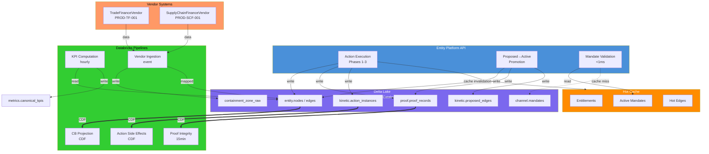

# Dimension 02 — Materialization Strategy

**Date:** 2026-05-22  
**Status:** Draft  
**Author:** Data Architect Agent  
**Scope:** Physical store architecture, table design, Unity Catalog topology, pipeline architecture, and volume estimates for the GTB canonical platform.

---

## 1. Materialization Principles

### 1.1 What Materialization Means Here

The canonical graph (Ontology Spec §1) is the **source of truth**. Materialization is always **derived from** the graph — never the other way around.

Materialization in this architecture has four distinct faces:

| Face | What It Is | Consumer |
|------|-----------|----------|
| **Canonical persistence** | Physical tables storing the graph itself (nodes, edges, proof chains) | Entity Platform API (sole write path) |
| **Kinetic materialization** | Tables storing declared business operations (action types, instances, functions, rules) and their execution history | Action execution pipeline, pre-flight validators |
| **Projection materialization** | LOB-scoped read-optimized views derived from canonical state | CB, CM, WM operational applications |
| **Containment Zone** | Isolated tables for vendor schema data not yet mapped to canonical ontology terms | Vendor ingestion pipeline, progressive mapping service |

This document covers canonical persistence, kinetic materialization, and containment zone design. Projection materialization is covered in the Unity Catalog topology section.

### 1.2 How the Kinetic Layer Changes Materialization

The pre-kinetic materialization design treated the graph as a static data catalog. The kinetic layer (§9 of the ontology spec) makes the ontology **operational** — three constructs that change materialization requirements:

1. **Interfaces** — polymorphic contracts (`IHasBalance`, `IIsSettlementTarget`, etc.) require an `interface_implementations` mapping table so the API can resolve "all settlement targets" without enumerating concrete node types.
2. **Action Types** — declared business operations with pre-flight rules, effects, and governance modes require persistent storage of action type definitions, action instances (execution history), and the two-phase write state machine (`proposed_edges`, `review_queue`, `compensating_actions`).
3. **Functions** — versioned business logic units require `function_definitions` and `business_rules` tables so rules are declared in the ontology, not hidden in application code.

**Key implication:** Actions produce side effects (new edges, proof records, state transitions) that must be materialized atomically. Functions need hot data paths — `validateMandateScope` must evaluate against current mandate state with <1ms latency. Kinetic layer tables are on the operational critical path, not batch-only.

### 1.3 Containment Zone Materialization

Vendor-hosted systems (Trade Finance PROD-TF-001, Supply Chain Finance PROD-SCF-001) introduce the fourth materialization face. The Containment Zone is a **semantic buffer** — vendor data lands here in its native schema. Progressive mapping lifts signal upward through the ontology layers over time until it reaches Core ontology terms. Mapping status (`Partial` → `Complete`) is tracked in `vendor_mapping_status`.

**Key implication:** Containment Zone tables live in a **separate Unity Catalog** (`tb_containment`) with separate governance. This isolates vendor schema volatility from the canonical store and allows independent lifecycle management.

---

## 2. Physical Store Architecture

### 2.1 The Decision: Delta Lake Only (No Separate Graph DB)

The previous architecture spec (§11 Technology Options) recommended Neo4j for canonical graph + Databricks for analytical projections. The Architectural Impact Analysis flagged this as **critical ambiguity**: the DDL implementation is entirely Delta Lake, but the API contract implies real-time graph operations.

**Resolution: Single-store Delta Lake architecture.**

#### Why Not Neo4j?

| Factor | Assessment |
|--------|-----------|
| **Volume** | ~200 customers Year 1, ~1,000 Year 5. Even with deep nesting (4 entities × ~10 products × ~100 virtual accounts), total node/edge count is ~5–8M — well within Delta Lake's operational query capability. |
| **Latency requirement** | Sub-5ms entitlement checks target a very specific hot path (party → channel access). This is a **point lookup**, not a multi-hop graph traversal. A properly indexed Delta table or a thin hot cache handles this. |
| **Synchronization burden** | Two-store requires CDC between Neo4j and Delta Lake. At this scale, the operational cost of maintaining consistency (eventual consistency windows, sync failure handling, dual-write semantics) outweighs the performance benefit. |
| **Platform ownership** | Daniel owns the Databricks on Azure environment. Adding Neo4j introduces a new platform to provision, monitor, patch, and back up. |
| **Append-only enforcement** | Delta Lake enforces `delta.appendOnly = true` at the storage layer. Neo4j would require application-layer enforcement, weakening the guarantee. |
| **Unity Catalog governance** | RLS, column masking, and temporal auditability are native to the Delta Lake + Unity Catalog stack. Neo4j would need a separate governance layer. |

#### Why Not PostgreSQL Either?

- No native append-only enforcement (relies on application-level constraints)
- No temporal time-travel (Delta Lake's `TIMESTAMP AS OF` is a killer feature for point-in-time queries)
- No Unity Catalog integration (RLS, column masking, grant management would be application-layer)
- Databricks is already locked — adding PostgreSQL duplicates the operational platform without clear benefit

### 2.2 Recommended Architecture: Delta Lake + Hot Cache

```
┌──────────────────────────────────────────────────────────────────┐
│                    Entity Platform API                            │
│              (Sole write path + read orchestration)               │
└──────────────┬──────────────────────────┬────────────────────────┘
               │                          │
    ┌──────────▼──────────┐      ┌────────▼────────┐
    │  Delta Lake (Azure) │      │  Hot Cache       │
    │  Unity Catalog      │      │  (Azure Cache    │
    │                     │      │   for Redis)     │
    │ • Canonical graph   │◀─────┤                  │
    │ • Proof registry    │      │ • Entitlements   │
    │ • Kinetic layer     │      │ • Mandate state  │
    │ • Containment zone  │      │ • Active edges   │
    │ • LOB projections   │      │   (hot subset)   │
    └──────────┬──────────┘      └──────────────────┘
               │
    ┌──────────▼──────────┐
    │  Databricks Compute │
    │                     │
    │ • Batch pipelines   │
    │ • CDF-triggered     │
    │ • KPI computation   │
    │ • Integrity sweeps  │
    └─────────────────────┘
```

#### Delta Lake — Canonical Persistence

All canonical state lives here: nodes, edges, proof chains, kinetic layer tables, containment zone tables, and LOB projections. This is the **system of record**.

**Strengths:**
- Append-only enforcement at storage layer (`delta.appendOnly = true`)
- Native time-travel for point-in-time queries
- Change Data Feed for pipeline triggering
- Liquid Clustering for query optimization without manual partitioning
- Unity Catalog governance (RLS, column masking, grants)
- Single platform (Databricks on Azure — already owned)

#### Hot Cache — Sub-Millisecond Operational Path

A thin read-through cache (Azure Cache for Redis) for the **hot subset** requiring sub-5ms access:

| Cached Data | Purpose | Cache Strategy |
|------------|---------|---------------|
| Active entitlements (party → channel access) | <5ms entitlement check | Write-through on change; TTL 5min |
| Active agent mandates | <1ms pre-flight validation | Write-through on change; TTL 1min |
| Active edges for hot entities | Fast relationship queries | Write-through on change; TTL 10min |
| Interface implementations | Polymorphic resolution | Static cache (refreshed on ontology change) |

**Why Redis?** Structured data support (hashes, sets), pub/sub for cache invalidation, managed Azure Cache for Redis integrates with Databricks workspace VNet, sub-millisecond latency for cache hits.

**Critical design rule:** Cache is **never** the source of truth. Cache miss → fall through to Delta Lake (~10-50ms for the miss, correctness preserved). Cache is an optimization, not a dependency.

### 2.3 Liquid Clustering Strategy

| Table | Cluster Columns | Dominant Query Pattern |
|-------|----------------|----------------------|
| `entity.nodes` | `(type, state, lei)` | UBO/ownership chain by type + LEI join |
| `entity.edges` | `(type, from_node_id, state)` | Graph traversal from a known node |
| `proof.proof_chains` | `(edge_id, integrity_status)` | Integrity sweep + edge lookup |
| `proof.proof_records` | `(chain_id, sequence)` | Full chain replay in order |
| `product.nodes` | `(type, state, product_code)` | Product lookup by code + type |
| `account.nodes` | `(type, state, owner_id)` | Account lookup by owner |
| `transaction.nodes` | `(type, state, settled_account_id, created_at)` | Transaction history by account + time |
| `channel.entitlements` | `(party_id, channel_type, state)` | Entitlement lookup by party |
| `channel.mandates` | `(agent_id, state)` | Mandate pre-flight check |
| `kinetic.action_instances` | `(action_type_id, status, created_at)` | Action history by type + time |
| `kinetic.proposed_edges` | `(review_status, created_at)` | Review queue ordering |
| `kinetic.function_definitions` | `(name, version)` | Function resolution by name + version |
| `kinetic.business_rules` | `(action_type_id, rule_name)` | Rule evaluation for pre-flight |
| `containment.vendor_systems` | `(vendor_id, state)` | Vendor system lookup |
| `containment.vendor_mapping_status` | `(vendor_field_ref, mapping_status)` | Mapping progress tracking |

---

## 3. Table Design (Delta Lake / Unity Catalog)

### 3.1 Catalog: `tb_canonical` — Schema: `entity`

#### `entity.nodes`

Append-only node table. Current state derived via `ROW_NUMBER()` in `current_nodes` view.

```sql
CREATE TABLE tb_canonical.entity.nodes (
    id STRING,                       -- UUID v4
    type STRING,                     -- node type enum (LegalEntity, OperatingAccount, etc.)
    lei STRING,                      -- LEI where applicable
    canonical_name STRING,
    aliases ARRAY<STRING>,
    created_at TIMESTAMP,
    created_by STRING,               -- ActorRef
    state STRING,                    -- Active | Suspended | Terminated | Disputed
    domain_extensions STRUCT<
        cb: MAP<STRING, STRING>,
        cm: MAP<STRING, STRING>,
        wm: MAP<STRING, STRING>
    >,
    proof_chain_id STRING,           -- FK to proof.proof_chains (NOT NULL)
    updated_at TIMESTAMP             -- for ROW_NUMBER() ordering
)
TBLPROPERTIES (
    'delta.appendOnly' = 'true',
    'delta.enableChangeDataFeed' = 'true'
)
CLUSTER BY (type, state, lei);
```

#### `entity.edges`

Append-only edge table. Current state derived via `ROW_NUMBER()` in `current_edges` view.

```sql
CREATE TABLE tb_canonical.entity.edges (
    id STRING,                       -- UUID v4
    type STRING,                     -- edge type enum (owns, isSubsidiaryOf, etc.)
    from_node_id STRING,             -- FK to entity.nodes.id
    to_node_id STRING,               -- FK to entity.nodes.id
    state STRING,                    -- Proposed | Verified | Active | Suspended | Terminated | Disputed
    effective_from TIMESTAMP,
    effective_to TIMESTAMP,
    created_at TIMESTAMP,
    created_by STRING,
    proof_chain_id STRING,           -- FK to proof.proof_chains (NOT NULL)
    domain_scope ARRAY<STRING>,      -- CB | CM | WM | ALL (RLS enforcement point)
    containment_zone BOOLEAN,        -- true if vendor-origin edge
    mapping_status STRING,           -- Partial | Complete (vendor edges only)
    vendor_schema_ref STRING,        -- original vendor field reference
    mapped_at TIMESTAMP,             -- last mapping update
    updated_at TIMESTAMP
)
TBLPROPERTIES (
    'delta.appendOnly' = 'true',
    'delta.enableChangeDataFeed' = 'true'
)
CLUSTER BY (type, from_node_id, state);
```

#### Views

```sql
-- Current state view (latest row per id)
CREATE OR REPLACE VIEW tb_canonical.entity.current_nodes AS
SELECT * FROM (
    SELECT *,
        ROW_NUMBER() OVER (PARTITION BY id ORDER BY updated_at DESC) AS rn
    FROM tb_canonical.entity.nodes
) WHERE rn = 1;

-- Current edges with RLS
CREATE OR REPLACE VIEW tb_canonical.entity.current_edges AS
SELECT * FROM (
    SELECT *,
        ROW_NUMBER() OVER (PARTITION BY id ORDER BY updated_at DESC) AS rn
    FROM tb_canonical.entity.edges
) WHERE rn = 1
  AND (array_contains(domain_scope, current_lob()) OR array_contains(domain_scope, 'ALL'));
```

### 3.2 Catalog: `tb_canonical` — Schema: `proof`

#### `proof.proof_chains`

```sql
CREATE TABLE tb_canonical.proof.proof_chains (
    id STRING,                       -- UUID v4
    edge_id STRING,                  -- FK to entity.edges.id
    current_state STRING,            -- derived from event replay
    integrity_status STRING,         -- Valid | Challenged | Broken | Expired
    created_at TIMESTAMP,
    updated_at TIMESTAMP
)
TBLPROPERTIES (
    'delta.appendOnly' = 'true',
    'delta.enableChangeDataFeed' = 'true'
)
CLUSTER BY (edge_id, integrity_status);
```

#### `proof.proof_records`

```sql
CREATE TABLE tb_canonical.proof.proof_records (
    id STRING,                       -- UUID v4
    chain_id STRING,                 -- FK to proof.proof_chains.id
    sequence LONG,                   -- monotonically increasing within chain
    event STRING,                    -- PROOF_ASSERTED | PROOF_VERIFIED | etc.
    proof_type STRING,               -- declarative | behavioural | delegated | agentic | systemic | regulatory
    intent_summary STRING,
    intent_payload STRING,           -- JSON blob (column-masked for non-auditors)
    actor_id STRING,
    actor_type STRING,               -- Human | System | Agent
    authority_basis STRING,
    entitlement_snapshot_id STRING,
    channel_type STRING,
    session_ref STRING,
    asserted_at TIMESTAMP,
    verified_at TIMESTAMP,
    expires_at TIMESTAMP,
    hash STRING,                     -- SHA-256 of record content
    previous_hash STRING,            -- hash of prior record (tamper-evident chain)
    signature STRING,                -- cryptographic signature (column-masked)
    created_at TIMESTAMP
)
TBLPROPERTIES (
    'delta.appendOnly' = 'true',
    'delta.enableChangeDataFeed' = 'true'
)
CLUSTER BY (chain_id, sequence);
```

#### Masked View (Column-Level Security)

```sql
CREATE OR REPLACE VIEW tb_canonical.proof.proof_records_masked AS
SELECT
    id, chain_id, sequence, event, proof_type, intent_summary,
    CASE WHEN current_role() IN ('auditor', 'proof_registry_reader')
         THEN intent_payload ELSE NULL END AS intent_payload,
    actor_id, actor_type, authority_basis,
    asserted_at, verified_at, expires_at, hash, previous_hash,
    CASE WHEN current_role() IN ('auditor', 'proof_registry_reader')
         THEN signature ELSE NULL END AS signature
FROM tb_canonical.proof.proof_records;
```

### 3.3 Catalog: `tb_canonical` — Schema: `product`

```sql
CREATE TABLE tb_canonical.product.nodes (
    id STRING,
    type STRING,                     -- ProductDefinition | ProductInstance | ProductBundle
    product_code STRING,             -- e.g., PROD-003, PROD-TF-001
    canonical_name STRING,
    aliases ARRAY<STRING>,
    created_at TIMESTAMP,
    created_by STRING,
    state STRING,
    domain_extensions STRUCT<cb: MAP<STRING, STRING>, cm: MAP<STRING, STRING>, wm: MAP<STRING, STRING>>,
    proof_chain_id STRING,
    hosting_model STRING,            -- Core | Vendor-Hosted
    vendor_system_id STRING,         -- FK to containment.vendor_systems (if Vendor-Hosted)
    updated_at TIMESTAMP
)
TBLPROPERTIES (
    'delta.appendOnly' = 'true',
    'delta.enableChangeDataFeed' = 'true'
)
CLUSTER BY (type, state, product_code);
```

### 3.4 Catalog: `tb_canonical` — Schema: `account`

```sql
CREATE TABLE tb_canonical.account.nodes (
    id STRING,
    type STRING,                     -- OperatingAccount | VirtualAccount | NotionalPool | PhysicalPool
    canonical_name STRING,
    owner_id STRING,                 -- FK to entity.nodes (LegalEntity)
    currency STRING,
    created_at TIMESTAMP,
    created_by STRING,
    state STRING,
    domain_extensions STRUCT<cb: MAP<STRING, STRING>, cm: MAP<STRING, STRING>, wm: MAP<STRING, STRING>>,
    proof_chain_id STRING,
    pool_weight DECIMAL(10, 4),      -- e.g., 35.5 for USA-East in Nexus pool
    updated_at TIMESTAMP
)
TBLPROPERTIES (
    'delta.appendOnly' = 'true',
    'delta.enableChangeDataFeed' = 'true'
)
CLUSTER BY (type, state, owner_id);
```

### 3.5 Catalog: `tb_canonical` — Schema: `transaction`

```sql
CREATE TABLE tb_canonical.transaction.nodes (
    id STRING,
    type STRING,                     -- Payment | TradeTransaction | FXTransaction | Fee | InterestPosting | SweepTransaction | Reversal
    canonical_name STRING,
    amount DECIMAL(18, 4),
    currency STRING,
    settled_account_id STRING,       -- FK to account.nodes
    initiated_by_id STRING,          -- FK to entity.nodes
    executed_via_channel_id STRING,  -- FK to channel.nodes
    created_at TIMESTAMP,
    created_by STRING,
    state STRING,
    proof_chain_id STRING,
    domain_scope ARRAY<STRING>,
    updated_at TIMESTAMP
)
TBLPROPERTIES (
    'delta.appendOnly' = 'true',
    'delta.enableChangeDataFeed' = 'true'
)
CLUSTER BY (type, state, settled_account_id, created_at);
```

### 3.6 Catalog: `tb_canonical` — Schema: `channel`

#### `channel.nodes`

```sql
CREATE TABLE tb_canonical.channel.nodes (
    id STRING,
    type STRING,                     -- DigitalPortal | APIChannel | H2HChannel | SWIFTChannel
    canonical_name STRING,
    created_at TIMESTAMP,
    state STRING,
    proof_chain_id STRING,
    updated_at TIMESTAMP
)
TBLPROPERTIES ('delta.appendOnly' = 'true', 'delta.enableChangeDataFeed' = 'true');
```

#### `channel.entitlements`

```sql
CREATE TABLE tb_canonical.channel.entitlements (
    id STRING,
    party_id STRING,                 -- FK to entity.nodes
    channel_type STRING,             -- FK to channel.nodes.type
    permissions ARRAY<STRING>,       -- e.g., ["accounts:read", "payments:initiate"]
    created_at TIMESTAMP,
    created_by STRING,
    state STRING,                    -- Active | Suspended | Revoked
    proof_chain_id STRING,
    updated_at TIMESTAMP
)
TBLPROPERTIES ('delta.appendOnly' = 'true', 'delta.enableChangeDataFeed' = 'true')
CLUSTER BY (party_id, channel_type, state);
```

#### `channel.entitlement_snapshots`

Point-in-time captures of entitlement state (for authority basis linkage in proof records).

```sql
CREATE TABLE tb_canonical.channel.entitlement_snapshots (
    id STRING,                       -- referenced by proof_records.entitlement_snapshot_id
    party_id STRING,
    channel_type STRING,
    permissions ARRAY<STRING>,
    captured_at TIMESTAMP,
    expires_at TIMESTAMP
)
TBLPROPERTIES ('delta.appendOnly' = 'true');
```

#### `channel.mandates`

```sql
CREATE TABLE tb_canonical.channel.mandates (
    id STRING,
    type STRING,                     -- HumanMandate | SystemMandate | AgentMandate
    agent_id STRING,
    parent_mandate_id STRING,        -- FK to channel.mandates.id (delegation chain)
    root_mandate_id STRING,          -- FK to channel.mandates.id (HumanMandate root)
    permitted_operations ARRAY<STRING>,
    limits STRUCT<max_amount: DECIMAL(18, 4), currency: STRING>,
    constraints ARRAY<STRING>,
    effective_from TIMESTAMP,
    effective_to TIMESTAMP,
    state STRING,                    -- Active | Suspended | Revoked
    created_at TIMESTAMP,
    proof_chain_id STRING,
    updated_at TIMESTAMP
)
TBLPROPERTIES ('delta.appendOnly' = 'true', 'delta.enableChangeDataFeed' = 'true')
CLUSTER BY (agent_id, state);
```

### 3.7 Catalog: `tb_canonical` — Schema: `kinetic`

**New schema** introduced by the kinetic layer (§9 of the ontology spec).

#### `kinetic.interfaces`

Polymorphic interface definitions.

```sql
CREATE TABLE tb_canonical.kinetic.interfaces (
    name STRING,                     -- e.g., "IHasBalance", "IIsSettlementTarget"
    required_properties ARRAY<STRING>,
    required_edges ARRAY<STRING>,
    description STRING,
    created_at TIMESTAMP,
    updated_at TIMESTAMP
)
TBLPROPERTIES ('delta.appendOnly' = 'true');
```

**Seed data:**

| name | required_properties | required_edges |
|------|-------------------|----------------|
| `IIdentifiable` | `["id", "lei", "canonical_name", "aliases"]` | `[]` |
| `IHasLifecycle` | `["state", "created_at"]` | `[]` |
| `IHasBalance` | `[]` | `["hasBalance"]` |
| `IIsSettlementTarget` | `[]` | `["settlesAgainst"]` |
| `IIsRegulatable` | `[]` | `["isKnownBy", "isScreenedAgainst", "isSubjectTo"]` |
| `IIsSubscribable` | `[]` | `["isSubscribedTo", "isEligibleFor"]` |
| `IIsPoolMember` | `[]` | `["isPartOf"]` |
| `IHasMandate` | `[]` | `["operatesUnder"]` |

#### `kinetic.interface_implementations`

Maps interfaces to concrete node types.

```sql
CREATE TABLE tb_canonical.kinetic.interface_implementations (
    interface_name STRING,           -- FK to kinetic.interfaces.name
    node_type STRING,                -- e.g., "OperatingAccount"
    created_at TIMESTAMP
)
TBLPROPERTIES ('delta.appendOnly' = 'true');
```

**Seed data (partial):**

| interface_name | node_type |
|---------------|-----------|
| `IHasBalance` | `OperatingAccount`, `TradingAccount`, `CustodyAccount`, `VirtualAccount` |
| `IIsSettlementTarget` | `OperatingAccount`, `TradingAccount`, `CustodyAccount` |
| `IIsRegulatable` | `LegalEntity`, `NaturalPerson`, `FinancialInstitution` |
| `IIsPoolMember` | `OperatingAccount`, `VirtualAccount` |
| `IHasMandate` | `NaturalPerson`, `AgentMandate` |

#### `kinetic.action_types`

Declared business operation definitions.

```sql
CREATE TABLE tb_canonical.kinetic.action_types (
    id STRING,                       -- unique action identifier
    name STRING,                     -- e.g., "AssertRelationship", "InitiatePayment"
    description STRING,
    version STRING,                  -- semantic version
    inputs ARRAY<STRUCT<name: STRING, type: STRING, required: BOOLEAN>>,
    pre_flight_rules ARRAY<STRING>,  -- references to kinetic.business_rules.id
    effects ARRAY<STRUCT<type: STRING, target: STRING, details: STRING>>,
    permissions ARRAY<STRING>,
    governance_mode STRING,          -- immediate | proposed | reviewed
    created_at TIMESTAMP,
    updated_at TIMESTAMP
)
TBLPROPERTIES ('delta.appendOnly' = 'true');
```

**Seed data (Nexus Global):**

| id | name | governance_mode |
|----|------|----------------|
| `ACT-001` | `AssertRelationship` | `proposed` |
| `ACT-002` | `ApproveKYCRenewal` | `immediate` |
| `ACT-003` | `InitiatePoolSweep` | `immediate` |
| `ACT-004` | `ExecuteFXForward` | `immediate` |
| `ACT-005` | `DrawdownIntercompanyFacility` | `reviewed` |
| `ACT-006` | `InitiatePayment` | `immediate` |

#### `kinetic.action_instances`

Execution history of actions. Every action invocation produces a row.

```sql
CREATE TABLE tb_canonical.kinetic.action_instances (
    id STRING,                       -- UUID v4
    action_type_id STRING,           -- FK to kinetic.action_types.id
    actor_id STRING,
    actor_type STRING,               -- Human | System | Agent
    inputs STRING,                   -- JSON: input parameters
    status STRING,                   -- pending | pre_flight_failed | executing | completed | compensated
    governance_mode STRING,          -- immediate | proposed | reviewed
    review_status STRING,            -- pending_review | approved | rejected
    review_by STRING,
    review_at TIMESTAMP,
    effects_applied STRING,          -- JSON: what graph mutations occurred
    proof_records_created ARRAY<STRING>,  -- FK to proof.proof_records.id
    error_message STRING,
    created_at TIMESTAMP,
    completed_at TIMESTAMP
)
TBLPROPERTIES ('delta.appendOnly' = 'true', 'delta.enableChangeDataFeed' = 'true')
CLUSTER BY (action_type_id, status, created_at);
```

#### `kinetic.function_definitions`

Versioned business logic units.

```sql
CREATE TABLE tb_canonical.kinetic.function_definitions (
    id STRING,
    name STRING,                     -- e.g., "deriveEdgeState", "validateMandateScope"
    description STRING,
    version STRING,                  -- semantic version
    inputs ARRAY<STRUCT<name: STRING, type: STRING>>,
    output_type STRING,
    logic STRING,                   -- business rule expression or code reference
    dependencies ARRAY<STRING>,      -- FK to kinetic.function_definitions.name
    audit_level STRING,              -- none | log | full
    created_at TIMESTAMP,
    updated_at TIMESTAMP
)
TBLPROPERTIES ('delta.appendOnly' = 'true');
```

**Seed data:**

| id | name | version | audit_level |
|----|------|---------|-------------|
| `FUNC-001` | `deriveEdgeState` | `1.0.0` | `log` |
| `FUNC-002` | `validateMandateScope` | `1.0.0` | `full` |
| `FUNC-003` | `computeProductEligibility` | `1.0.0` | `log` |
| `FUNC-004` | `computeSigningAuthority` | `1.0.0` | `full` |
| `FUNC-005` | `computePoolInterest` | `1.0.0` | `full` |
| `FUNC-006` | `validateTransferPricing` | `1.0.0` | `full` |

#### `kinetic.business_rules`

Individual pre-flight rules referenced by action types.

```sql
CREATE TABLE tb_canonical.kinetic.business_rules (
    id STRING,
    name STRING,
    action_type_id STRING,           -- FK to kinetic.action_types.id (nullable for shared rules)
    description STRING,
    expression STRING,               -- rule expression (compiled to graph query)
    function_id STRING,              -- FK to kinetic.function_definitions.id
    severity STRING,                 -- blocking | warning | informational
    created_at TIMESTAMP,
    updated_at TIMESTAMP
)
TBLPROPERTIES ('delta.appendOnly' = 'true')
CLUSTER BY (action_type_id, name);
```

#### `kinetic.proposed_edges`

Two-phase write: edges in Proposed state awaiting review.

```sql
CREATE TABLE tb_canonical.kinetic.proposed_edges (
    id STRING,                       -- same as entity.edges.id
    edge_id STRING,                  -- FK to entity.edges.id
    type STRING,
    from_node_id STRING,
    to_node_id STRING,
    proof_chain_id STRING,
    review_status STRING,            -- pending | approved | rejected
    review_by STRING,
    review_at TIMESTAMP,
    review_rationale STRING,
    created_at TIMESTAMP,
    expires_at TIMESTAMP             -- SLA deadline (48h for relationship assertions)
)
TBLPROPERTIES ('delta.appendOnly' = 'true', 'delta.enableChangeDataFeed' = 'true')
CLUSTER BY (review_status, created_at);
```

#### `kinetic.review_queue`

Ordered queue of items awaiting review.

```sql
CREATE TABLE tb_canonical.kinetic.review_queue (
    id STRING,
    item_type STRING,                -- proposed_edge | reviewed_action
    item_id STRING,
    action_type_id STRING,
    review_sla TIMESTAMP,
    priority STRING,                 -- critical | high | normal | low
    status STRING,                   -- pending | in_review | completed
    assigned_reviewer STRING,
    created_at TIMESTAMP
)
TBLPROPERTIES ('delta.appendOnly' = 'true', 'delta.enableChangeDataFeed' = 'true')
CLUSTER BY (status, review_sla);
```

#### `kinetic.compensating_actions`

Compensating actions for REVIEWED governance mode failures.

```sql
CREATE TABLE tb_canonical.kinetic.compensating_actions (
    id STRING,
    original_action_instance_id STRING,  -- FK to kinetic.action_instances.id
    reason STRING,
    effects STRING,                      -- JSON: what to undo
    status STRING,                       -- pending | executing | completed | failed
    executed_at TIMESTAMP,
    created_at TIMESTAMP
)
TBLPROPERTIES ('delta.appendOnly' = 'true', 'delta.enableChangeDataFeed' = 'true');
```

### 3.8 Catalog: `tb_canonical` — Schema: `metrics`

(No change from existing DDL design.)

```sql
CREATE TABLE tb_canonical.metrics.metric_definitions (
    metric_name STRING,
    definition STRING,
    target_value STRING,
    computation_logic STRING,
    created_at TIMESTAMP
)
TBLPROPERTIES ('delta.appendOnly' = 'true');

CREATE TABLE tb_canonical.metrics.canonical_kpis (
    metric_name STRING,
    value DECIMAL(18, 4),
    computed_at TIMESTAMP,
    period_start TIMESTAMP,
    period_end TIMESTAMP
)
TBLPROPERTIES ('delta.appendOnly' = 'true');
```

### 3.9 Catalog: `tb_containment` — Schema: `vendor`

**Separate catalog** for vendor containment zone data. Isolated governance, independent lifecycle.

#### `containment.vendor_systems`

```sql
CREATE TABLE tb_containment.vendor.vendor_systems (
    id STRING,
    vendor_id STRING,                -- e.g., "TradeFinanceVendor", "SupplyChainFinanceVendor"
    vendor_name STRING,
    vendor_api_version STRING,       -- e.g., "TF-API-v2.1"
    product_code STRING,             -- e.g., "PROD-TF-001"
    containment_zone BOOLEAN,        -- always true
    state STRING,                    -- Active | Suspended | Decommissioned
    created_at TIMESTAMP,
    updated_at TIMESTAMP
)
TBLPROPERTIES ('delta.appendOnly' = 'true', 'delta.enableChangeDataFeed' = 'true')
CLUSTER BY (vendor_id, state);
```

**Seed data (Nexus Global):**

| vendor_id | vendor_name | vendor_api_version | product_code |
|-----------|------------|-------------------|-------------|
| `VS-001` | TradeFinanceVendor | TF-API-v2.1 | PROD-TF-001 |
| `VS-002` | SupplyChainFinanceVendor | SCF-API-v1.4 | PROD-SCF-001 |

#### `containment.containment_zone_raw`

Vendor data in native schema. Structure varies by vendor.

```sql
CREATE TABLE tb_containment.vendor.containment_zone_raw (
    id STRING,
    vendor_id STRING,                -- FK to containment.vendor_systems.vendor_id
    raw_payload STRING,              -- JSON: vendor-native data
    vendor_record_id STRING,
    ingested_at TIMESTAMP,
    processing_status STRING,        -- raw | parsed | mapped | failed
    error_message STRING
)
TBLPROPERTIES ('delta.appendOnly' = 'true', 'delta.enableChangeDataFeed' = 'true')
CLUSTER BY (vendor_id, processing_status, ingested_at);
```

#### `containment.vendor_mapping_status`

Tracks progressive harmonization of vendor fields to canonical ontology terms.

```sql
CREATE TABLE tb_containment.vendor.vendor_mapping_status (
    id STRING,
    vendor_id STRING,
    vendor_field_ref STRING,         -- original vendor field/path
    canonical_term STRING,           -- mapped ontology term
    mapping_status STRING,           -- Partial | Complete
    confidence_score DECIMAL(4, 2),  -- 0.00 to 1.00
    mapped_by STRING,
    mapped_at TIMESTAMP,
    last_validated_at TIMESTAMP,
    notes STRING
)
TBLPROPERTIES ('delta.appendOnly' = 'true', 'delta.enableChangeDataFeed' = 'true')
CLUSTER BY (vendor_field_ref, mapping_status);
```

---

## 4. Unity Catalog Topology

### 4.1 Catalog Structure

```
tb_canonical                          ← source of truth (Channels Technology)
├── entity                            ← Party, EntityGroup, LegalEntity, etc.
│   ├── nodes / edges / current_nodes / current_edges / legal_entities / kyc_status / ubo_resolution
├── product                           ← ProductDefinition, ProductInstance, ProductBundle
│   ├── nodes / current_nodes / adoption_by_definition
├── account                           ← OperatingAccount, VirtualAccount, Pool types
│   ├── nodes / current_nodes / pool_membership
├── transaction                       ← Payment, FXTransaction, SweepTransaction, etc.
│   ├── nodes / current_nodes / stp_eligibility
├── channel                           ← Channel + entitlement + mandate
│   ├── nodes / entitlements / entitlement_snapshots / mandates / current_entitlements / active_agent_mandates
├── proof                             ← Proof chain + records
│   ├── proof_chains / proof_records / current_proof_chains / broken_chains / proof_records_masked
├── kinetic                           ← NEW: Kinetic layer
│   ├── interfaces / interface_implementations / action_types / action_instances
│   ├── function_definitions / business_rules / proposed_edges / review_queue / compensating_actions
└── metrics                           ← Canonical KPIs
    ├── metric_definitions / canonical_kpis / current_kpis / kpi_trend_30d

tb_containment                        ← vendor containment zone (separate governance)
└── vendor
    ├── vendor_systems / containment_zone_raw / vendor_mapping_status

tb_cb                                 ← CB LOB views (never writes to tb_canonical)
tb_cm                                 ← CM LOB views
tb_wm                                 ← WM LOB views
```

### 4.2 Grant Structure

```sql
-- Channels Technology: full ownership of tb_canonical
GRANT OWN ON CATALOG tb_canonical TO `channels-tech-admin`;
GRANT USAGE ON CATALOG tb_canonical TO `channels-tech-reader`;

-- Entity Platform: write access (sole write path)
GRANT WRITE ON CATALOG tb_canonical TO `entity-platform-writer`;

-- Auditor: read access with unmasked proof records
GRANT READ ON CATALOG tb_canonical TO `auditor`;
GRANT SELECT ON TABLE tb_canonical.proof.proof_records TO `auditor`;

-- LOB consumers: read-only via projection views with RLS
GRANT USAGE ON CATALOG tb_cb TO `cb-consumer`;
GRANT USAGE ON CATALOG tb_cm TO `cm-consumer`;
GRANT USAGE ON CATALOG tb_wm TO `wm-consumer`;

-- Containment Zone: separate governance
GRANT OWN ON CATALOG tb_containment TO `vendor-integration-admin`;
GRANT READ ON CATALOG tb_containment TO `vendor-integration-reader`;

-- Pipeline service: read + write for CDF-triggered jobs
GRANT READ ON CATALOG tb_canonical TO `pipeline-service`;
GRANT WRITE ON SCHEMA tb_canonical.metrics TO `pipeline-service`;
```

### 4.3 Row-Level Security

RLS via `domain_scope ARRAY<STRING>` on `entity.edges`. The `current_edges` view filters:

```sql
WHERE array_contains(domain_scope, current_lob()) OR array_contains(domain_scope, 'ALL')
```

LOB catalogs are derived views — they never contain data from other LOBs because the canonical view already excludes it.

---

## 5. Pipeline Architecture

### 5.1 Existing Pipelines (unchanged)

| Pipeline | Trigger | Cadence | Purpose |
|----------|---------|---------|---------|
| Proof Integrity Sweep | Scheduled | Every 15 min | Verify hash chain integrity; flag broken/expired chains |
| KPI Computation | Scheduled | Hourly | Compute canonical KPIs; append to `canonical_kpis` |
| CB Projection Refresh | CDF-triggered | On entity.edges change | Refresh `tb_cb` operational projection |
| Entitlement Snapshot | CDF-triggered | On entitlement change | Capture point-in-time entitlement state |

### 5.2 New Pipelines (Kinetic Layer)

#### Action Execution Pipeline

```
Actor invokes Action Type via Entity Platform API
    │
    ├── Phase 1: Pre-flight Validation
    │   ├── Load action_type from kinetic.action_types
    │   ├── Load pre_flight_rules from kinetic.business_rules
    │   ├── Evaluate each rule (delegate to function if needed)
    │   └── Fail → return pre_flight_failed, log to action_instances
    │
    ├── Phase 2: Execute Effects
    │   ├── Apply graph mutations (create edges, nodes, state transitions)
    │   ├── Append proof records to relevant chains
    │   └── Write action_instances row (status=completed)
    │
    └── Phase 3: Governance Routing
        ├── IMMEDIATE → done
        ├── PROPOSED  → write to kinetic.proposed_edges, add to review_queue
        └── REVIEWED  → schedule async review, set SLA deadline
```

**Implementation:** Runs within the Entity Platform API (synchronous Phase 1-2, asynchronous Phase 3).

#### Function Evaluation Pipeline

```
State change detected (CDF on entity.edges or channel.mandates)
    │
    ├── Identify affected functions (via kinetic.function_definitions.dependencies)
    ├── Evaluate functions in dependency order
    │   ├── deriveEdgeState → re-derive edge state from proof chain replay
    │   ├── validateMandateScope → if mandate state changed
    │   └── computeProductEligibility → if KYC/sanctions status changed
    │
    └── Write evaluation results to cache (if audit_level=LOG or FULL)
```

**Implementation:** CDF-triggered Databricks Job.

#### Proposed → Active Promotion Pipeline

```
Review action received via Entity Platform API
    │
    ├── Load proposed_edge from kinetic.proposed_edges
    ├── If approved:
    │   ├── Append PROOF_VERIFIED to proof chain
    │   ├── Transition edge state to Active (new append-only row)
    │   └── Invalidate cache entries for affected entities
    │
    └── If rejected:
        ├── Append PROOF_INVALIDATED to proof chain
        ├── Transition edge state to Terminated
        └── Alert originating actor
```

**Implementation:** Synchronous API endpoint (`POST /proposals/{id}/review`). Cache invalidation via Redis pub/sub.

#### Vendor Data Ingestion Pipeline

```
Vendor API / Webhook / File Drop
    │
    ├── Phase 1: Ingest Raw → containment_zone_raw (processing_status='raw')
    ├── Phase 2: Parse → apply vendor-specific parser → processing_status='parsed'
    ├── Phase 3: Progressive Mapping
    │   ├── mapping_status='Complete' → create canonical edge/node
    │   ├── mapping_status='Partial' → create edge with containment_zone=true
    │   └── no mapping → leave in containment zone, flag for manual review
    │
    └── Phase 4: Canonical Integration
        ├── Create VendorSystem node (if first ingestion)
        ├── Create isHostedBy edge from ProductInstance → VendorSystem
        └── Append SYSTEMIC proof record for ingestion event
```

**Implementation:** Databricks Job triggered on vendor data arrival (Event Grid → webhook). Multi-step: ingest → parse → map → integrate.

### 5.3 Pipeline Data Flow



---

## 6. Nexus Global Volume Estimates

### 6.1 Node Counts

| Node Type | Count/Customer | 200 Customers (Y1) | 1,000 Customers (Y5) |
|-----------|---------------|-------------------|---------------------|
| LegalEntity | ~4 | ~800 | ~4,000 |
| NaturalPerson | ~8 | ~1,600 | ~8,000 |
| EntityGroup | ~1 | ~200 | ~1,000 |
| ProductInstance | ~10 | ~2,000 | ~10,000 |
| OperatingAccount | ~4 | ~800 | ~4,000 |
| VirtualAccount | ~100 | ~20,000 | ~100,000 |
| NotionalPool / PhysicalPool | ~2 | ~400 | ~2,000 |
| Channel | ~3 | ~600 | ~3,000 |
| Regulator | ~3 (shared) | ~3 | ~3 |
| VendorSystem | ~2 (shared) | ~2 | ~2 |
| **Total Nodes** | — | **~28,205** | **~132,009** |

### 6.2 Edge Counts

| Edge Type | Count/Customer | 200 Customers (Y1) | 1,000 Customers (Y5) |
|-----------|---------------|-------------------|---------------------|
| isSubsidiaryOf | ~3 | ~600 | ~3,000 |
| owns (Party → Account) | ~8 | ~1,600 | ~8,000 |
| isSubscribedTo | ~10 | ~2,000 | ~10,000 |
| isPartOf (pool membership) | ~100 | ~20,000 | ~100,000 |
| hasBalance | ~108 | ~21,600 | ~108,000 |
| hasSigningAuthority | ~4 | ~800 | ~4,000 |
| isKnownBy (KYC) | ~12 | ~2,400 | ~12,000 |
| isScreenedAgainst | ~12 | ~2,400 | ~12,000 |
| operatesUnder (mandate) | ~4 | ~800 | ~4,000 |
| isHostedBy (vendor) | ~2 | ~400 | ~2,000 |
| **Total Edges** | — | **~62,600** | **~323,000** |

### 6.3 Proof Record Volume

| Metric | Y1 (200 customers) | Y5 (1,000 customers) |
|--------|-------------------|---------------------|
| Proof chains | ~62,600 | ~323,000 |
| Proof records/chain (avg) | ~3 | ~5 |
| Total proof records | ~187,800 | ~1,615,000 |
| Annual growth | — | ~30K new records/year (steady state) |

### 6.4 Kinetic Layer Volume

| Metric | Y1 (200 customers) | Y5 (1,000 customers) |
|--------|-------------------|---------------------|
| Action types (defined) | 6 | 6+ |
| Action instances (monthly) | ~5,000 | ~25,000 |
| Function evaluations (monthly) | ~10,000 | ~50,000 |
| Proposed edges (concurrent) | ~50 | ~250 |
| Business rules (defined) | ~30 | ~50 |

### 6.5 Storage Projections

| Component | Y1 | Y5 | Notes |
|-----------|-----|-----|-------|
| entity.nodes | ~50 MB | ~250 MB | 28K → 132K rows × ~2KB avg |
| entity.edges | ~100 MB | ~500 MB | 62K → 323K rows × ~1.5KB avg |
| proof.proof_records | ~500 MB | ~5 GB | JSON payloads dominate |
| kinetic.action_instances | ~10 MB/mo | ~50 MB/mo | Execution history accumulates |
| containment.containment_zone_raw | ~200 MB | ~1 GB | Depends on ingestion frequency |
| **Total Delta Lake** | **~1 GB** | **~10 GB** | Very modest |

**Key observation:** At this scale, storage is not a concern. The primary engineering challenge is **latency** (sub-5ms entitlement checks) and **correctness** (append-only enforcement, hash chain integrity), not scale.

---

## 7. Open Questions / Risks

### 7.1 Resolved

| Question | Resolution |
|----------|-----------|
| Neo4j vs Delta Lake | **Delta Lake only.** Volumes too modest for separate graph DB. |
| Hot cache technology | **Azure Cache for Redis.** Write-through invalidation via CDF. |
| Containment Zone governance | **Separate `tb_containment` catalog** with independent grants. |
| Kinetic layer table design | **9 tables** in `tb_canonical.kinetic` schema covering interfaces, actions, functions, rules, two-phase write, and compensation. |

### 7.2 Remaining

| Risk | Severity | Notes |
|------|----------|-------|
| **Sub-5ms entitlement on Delta Lake (cache miss)** | 🟠 Medium | Cache hit <1ms. Miss → Delta Lake (~10-50ms). Need to benchmark actual point-lookup latency. If miss rate >5%, p99 exceeds 5ms. |
| **Vendor API contract review** | 🔴 Critical | TF-API-v2.1 and SCF-API-v1.4 schemas unknown. Containment Zone design assumes JSON. If vendors use XML/EDI/flat files, need format-specific adapters. Blocks vendor integration. |
| **Initial seeding strategy** | 🟠 High | How to populate 200+ existing customers into append-only tables with valid proof chains? Legacy relationships lack digital evidence. Need migration runbook with exception handling. |
| **Hash chain computation at batch scale** | 🟡 Medium | SHA-256 per proof record is trivial individually but significant at ~188K initial records. Need benchmark on seed volume × hash throughput. Consider Spark UDF batch computation. |
| **API non-functional requirements** | 🟡 Medium | Rate limiting, pagination, circuit breakers, retry semantics not defined. LOB consumers need these before Phase 2. |
| **Business rule engine selection** | 🟡 Medium | Pre-flight rules need evaluation engine. Options: lightweight expression engine (recommended Phase 1), Drools (if rules grow complex), custom DSL. Current design assumes rules compile to graph queries — needs validation. |

### 7.3 Phase 1 Readiness Checklist

- [ ] Benchmark Delta Lake point-lookup latency for entitlement queries (with Liquid Clustering)
- [ ] Validate Redis cache hit rate assumptions against expected access patterns
- [ ] Complete vendor API contract review (Trade Finance + Supply Chain Finance)
- [ ] Define initial seeding runbook with proof chain exception handling
- [ ] Benchmark hash chain computation throughput for ~188K initial proof records
- [ ] Define API non-functional requirements (rate limits, pagination, circuit breakers)
- [ ] Select business rule evaluation engine for kinetic layer pre-flight rules

---

**Document end.** References ontology spec §2.1-2.3 (nodes/edges), §9 (kinetic layer), §14 (Nexus Global).
