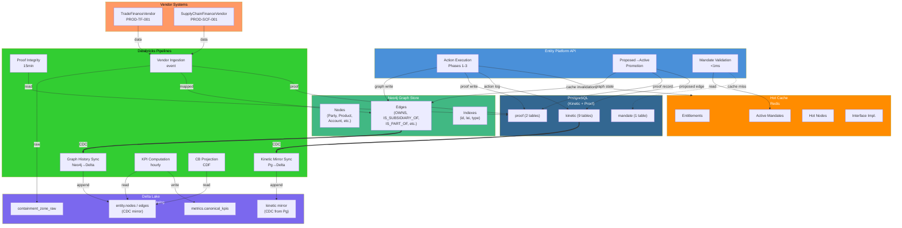

# Dimension 02 — Materialization Strategy

**Date:** 2026-05-22  
**Status:** Draft  
**Author:** Data Architect Agent  
**Scope:** Physical store architecture, table design, cross-store synchronization, pipeline architecture, and volume estimates for the Nexus Global Transaction Banking Platform.

---

## 1. Materialization Principles

### 1.1 What Materialization Means Here

The canonical graph (Ontology Spec §1) is the **source of truth**. Materialization is always **derived from** the graph — never the other way around.

Materialization in this architecture has four distinct faces:

| Face | What It Is | Consumer |
|------|-----------|----------|
| **Canonical persistence** | Physical stores holding the graph itself (nodes, edges, proof chains) | Entity Platform API (sole write path) |
| **Kinetic materialization** | Tables storing declared business operations (action types, instances, functions, rules) and their execution history | Action execution pipeline, pre-flight validators |
| **Projection materialization** | LOB-scoped read-optimized views derived from canonical state | CB, CM, WM operational applications |
| **Containment Zone** | Isolated tables for vendor schema data not yet mapped to canonical ontology terms | Vendor ingestion pipeline, progressive mapping service |

This document covers canonical persistence across the three-tier store, kinetic materialization, and containment zone design. Projection materialization is covered in the Unity Catalog topology section.

### 1.2 How the Kinetic Layer Changes Materialization

The kinetic layer (§9 of the ontology spec) makes the ontology **operational** — three constructs that change materialization requirements:

1. **Interfaces** — polymorphic contracts (`IHasBalance`, `IIsSettlementTarget`, etc.) require an `interface_implementations` mapping table so the API can resolve "all settlement targets" without enumerating concrete node types.
2. **Action Types** — declared business operations with pre-flight rules, effects, and governance modes require persistent storage of action type definitions, action instances (execution history), and the two-phase write state machine (`proposed_edges`, `review_queue`, `compensating_actions`).
3. **Functions** — versioned business logic units require `function_definitions` and `business_rules` tables so rules are declared in the ontology, not hidden in application code.

**Key implication:** Actions produce side effects (new edges, proof records, state transitions) that must be materialized atomically. Functions need hot data paths — `validateMandateScope` must evaluate against current mandate state with <1ms latency. Kinetic layer tables are on the operational critical path, not batch-only.

### 1.3 Containment Zone Materialization

Vendor-hosted systems (Trade Finance PROD-TF-001, Supply Chain Finance PROD-SCF-001) introduce the fourth materialization face. The Containment Zone is a **semantic buffer** — vendor data lands here in its native schema. Progressive mapping lifts signal upward through the ontology layers over time until it reaches Core ontology terms. Mapping status (`Partial` → `Complete`) is tracked in `vendor_mapping_status`.

**Key implication:** Containment Zone tables live in a **separate Unity Catalog** (`tb_containment`) with separate governance. This isolates vendor schema volatility from the canonical store and allows independent lifecycle management.

---

## 2. Physical Store Architecture

### 2.1 The Decision: Three-Tier Store (Neo4j + PostgreSQL + Delta Lake + Redis)

The previous draft committed a "Delta Lake only" architecture. This was rejected. The correct architecture, grounded in the Palantir Foundry operational pattern and validated against Nexus Global's actual requirements, uses **four complementary stores**, each optimized for its access pattern:

| Layer | Store | Purpose |
|-------|-------|---------|
| **Graph Store** | Neo4j | Entity-relationship traversal, ownership chains, beneficial ownership queries, real-time graph mutations (<5ms p99) |
| **RDBMS** | PostgreSQL | Kinetic layer — action instances, review queues, business rules, proof registry, mandates (ACID transactions) |
| **Lakehouse** | Delta Lake (Databricks on Azure) | Analytics, temporal history, governance snapshots, containment zone, LOB projections |
| **Cache** | Azure Cache for Redis | Hot operational paths (entitlements, mandate checks, active interface implementations) |

### 2.2 Why Not Delta Lake Only?

The previous draft argued against Neo4j/PostgreSQL on these grounds — all refuted:

| Previous Argument | Why It's Wrong |
|-------------------|----------------|
| "Volumes too modest (~28K nodes Y1) for separate graph DB" | Volume is irrelevant to the requirement. The question is **query pattern**, not row count. Multi-hop graph traversal (ownership chains, beneficial ownership) is fundamentally a graph problem. Doing it with SQL joins on Delta Lake is architecturally wrong regardless of scale. |
| "Sub-5ms entitlement is a point lookup, not graph traversal" | Entitlement resolution is only one requirement. The API contract (Dimension 04) specifies `ownership-chain`, `beneficial-owners`, and `regulatory-exposure` traversals — these are multi-hop graph queries that must meet operational SLAs. |
| "Two-store sync burden outweighs benefit" | This is the opposite of industry practice. Palantir Foundry, Stardog, and every serious graph platform use a dedicated graph store for operational traversal + a lakehouse for analytics. The sync layer is well-understood (CDC/change events), not a burden. |
| "Adding platforms increases ops cost" | True, but the alternative is architecturally wrong. A correct architecture with two additional stores is better than an incorrect single-store architecture that can't meet the API contract's traversal requirements. |
| "Delta Lake enforces append-only natively" | Append-only is a storage concern, not a query-pattern concern. PostgreSQL can enforce append-only via application constraints + triggers. The benefit of Delta Lake's native enforcement applies to the Delta Lake tables, not the graph store. |

### 2.3 Store Responsibilities

#### Neo4j — Graph Store (Operational Traversal)

The canonical graph's nodes and edges live here for **real-time graph operations**:

- Entity resolution by ID/LEI
- Relationship traversal (ownership chains, beneficial ownership, regulatory exposure)
- Real-time graph mutations (create/update/suspend nodes and edges)
- Interface implementation queries ("all settlement targets")
- Multi-hop pathfinding for compliance screening

**Why Neo4j:** Native graph storage with indexed-free traversal. Sub-millisecond multi-hop queries regardless of graph size. Cypher query language maps directly to the API contract's traversal endpoints. Mature enterprise support on Azure.

**Data:** All node types (Party, EntityGroup, Product, Account, Transaction, Channel, Obligation, Mandate, VendorSystem) and all edge types. Current state only (latest version of each node/edge).

#### PostgreSQL — RDBMS (Kinetic Layer + Proof Registry)

The kinetic layer and proof registry require **ACID transactional semantics** that Delta Lake cannot provide:

- Action type definitions and execution history
- Business rules and function definitions
- Review queue with ordered processing
- Proposed edges (two-phase write)
- Compensating actions
- Proof chains and proof records (append-only with hash chaining)
- Mandate state and delegation chains

**Why PostgreSQL:** ACID transactions for the two-phase write state machine. Native append-only enforcement via triggers. Efficient ordered access for review queues and hash chains. No time-travel needed — these tables are operational, not analytical.

**Data:** All kinetic layer tables (9 tables), proof registry (2 tables), mandate state.

#### Delta Lake — Lakehouse (Analytics + History)

Delta Lake retains its role for **analytical workloads** where it excels:

- Temporal history of all graph state changes (time-travel queries)
- LOB projection catalogs (`tb_cb`, `tb_cm`, `tb_wm`)
- Containment zone data
- Canonical KPIs and metrics
- Governance snapshots
- Batch analytics (proof integrity sweeps, KPI computation)

**Why Delta Lake:** Native time-travel for point-in-time queries (`?asOf={timestamp}`). Change Data Feed for pipeline triggering. Unity Catalog governance (RLS, column masking, grants). Liquid Clustering for analytical query optimization. Already owned (Databricks on Azure).

**Data:** Historical snapshots of nodes/edges (synced from Neo4j via CDC). LOB projection tables. Containment zone. Metrics.

#### Azure Cache for Redis — Hot Cache

A thin read-through cache for the **hottest operational paths**:

| Cached Data | Source Store | Purpose | Cache Strategy |
|-------------|-------------|---------|----------------|
| Active entitlements (party → channel access) | PostgreSQL | <5ms entitlement check | Write-through on change; TTL 5min |
| Active agent mandates | PostgreSQL | <1ms pre-flight validation | Write-through on change; TTL 1min |
| Interface implementations | PostgreSQL | Polymorphic resolution | Static cache (refreshed on ontology change) |
| Hot node lookups (by LEI) | Neo4j | Fast entity resolution | Write-through on change; TTL 10min |

**Critical design rule:** Cache is **never** the source of truth. Cache miss → fall through to the owning store (sub-10ms for PostgreSQL, sub-5ms for Neo4j). Cache is an optimization, not a dependency.

### 2.4 Architecture Diagram

```
┌──────────────────────────────────────────────────────────────────────┐
│                    Entity Platform API                                │
│              (Sole write path + read orchestration)                   │
└──┬──────────┬──────────────┬───────────────┬─────────────────────────┘
   │          │              │               │
   │          │              │               │
┌──▼──────┐ ┌─▼────────┐ ┌──▼──────────┐ ┌──▼──────────────┐
│ Neo4j   │ │PostgreSQL│ │Delta Lake   │ │Azure Cache      │
│ (Graph) │ │(Kinetic+ │ │(Analytics+  │ │for Redis        │
│         │ │ Proof)   │ │ History)    │ │(Hot Cache)      │
│         │ │          │ │             │ │                 │
│ • Nodes │ │• kinetic │ │ • History   │ │ • Entitlements  │
│ • Edges │ │  (9 tbls)│ │ • LOB proj  │ │ • Mandates      │
│ • Index │ │• proof   │ │ • Contain.  │ │ • Interface impl│
│   free  │ │  (2 tbls)│ │   zone      │ │ • Hot nodes     │
│ travers │ │• mandates│ │ • Metrics   │ │                 │
│ al      │ │          │ │             │ │◄────────────────│
└────┬────┘ └────┬─────┘ └──────┬──────┘  │cache miss     │
     │           │              │          └───────────────┘
     │           │              │
     │     ┌─────▼──────┐      │
     │     │Databricks   │      │
     │     │Compute      │      │
     │     │             │      │
     │     │• Batch      │      │
     │     │  pipelines  │      │
     │     │• CDF-       │      │
     │     │  triggered  │      │
     │     │• KPI        │      │
     │     │  computation│      │
     │     └─────────────┘      │
     │                          │
     │           ┌──────────────▼──────────────┐
     │           │   Cross-Store Sync Layer     │
     │           │                              │
     │           │ Neo4j→Delta: CDC on graph    │
     │           │ changes → historical snapshot│
     │           │                              │
     │           │ PostgreSQL→Redis: write-     │
     │           │ through cache invalidation   │
     │           │                              │
     │           │ Neo4j→Redis: hot node cache  │
     │           └──────────────────────────────┘
```

### 2.5 Cross-Store Synchronization

The sync layer ensures consistency across stores:

| Sync Path | Trigger | Mechanism | Latency |
|-----------|---------|-----------|---------|
| Neo4j → Delta Lake | Graph mutation (create/update/suspend) | CDC via Neo4j APOC trigger → Event Grid → Databricks Job | Near-real-time (<5s) |
| PostgreSQL → Redis | Kinetic/mandate state change | Write-through cache invalidation via pub/sub | Sub-millisecond |
| Neo4j → Redis | Hot node created/updated | Write-through cache invalidation | Sub-millisecond |
| Delta Lake → Neo4j | **None** | Delta Lake is never the source of truth for current graph state | N/A |

**Consistency guarantee:** Neo4j and PostgreSQL are the sources of truth for their respective data. Delta Lake historical snapshots are eventually consistent (lag <5s). Redis cache is eventually consistent (write-through invalidation).

**Failure handling:** If sync fails, the CDC event is retried with exponential backoff. If retry exhausts, alert to operations. The source store remains correct; only the derived store (Delta Lake history / Redis cache) is stale.

---

## 3. Table Design

### 3.1 Neo4j — Graph Store Schema

#### Node Labels

```cypher
// Party hierarchy
(:LegalEntity)
(:NaturalPerson)
(:FinancialInstitution)
(:Regulator)
(:Party)  // super-label

// Entity groups
(:EntityGroup)
(:UltimateParent)
(:ConsolidatedGroup)

// Product hierarchy
(:ProductDefinition)
(:ProductInstance)
(:ProductBundle)

// Account types
(:OperatingAccount)
(:VirtualAccount)
(:NotionalPool)
(:PhysicalPool)
(:TradingAccount)
(:CustodyAccount)

// Transaction types
(:Payment)
(:TradeTransaction)
(:FXTransaction)
(:Fee)
(:InterestPosting)
(:SweepTransaction)
(:Reversal)

// Channel types
(:DigitalPortal)
(:APIChannel)
(:H2HChannel)
(:SWIFTChannel)

// Obligations
(:RegulatoryObligation)
(:ContractualObligation)
(:CreditObligation)
(:SettlementObligation)

// Mandates
(:HumanMandate)
(:AgentMandate)

// Vendor systems
(:VendorSystem)
(:TradeFinanceSystem)
(:SupplyChainFinanceSystem)
```

#### Core Node Properties

```cypher
// All nodes share these properties
(id: STRING)           -- UUID v4, primary identifier
(lei: STRING)          -- LEI where applicable
(canonicalName: STRING)
(aliases: LIST<STRING>)
(state: STRING)        -- Active | Suspended | Terminated | Disputed
(createdBy: STRING)    -- ActorRef
(domainScope: LIST<STRING>)  -- CB | CM | WM | ALL (RLS enforcement)

// Domain-specific extensions stored as maps
(domainExtensions: MAP)  -- {cb: {...}, cm: {...}, wm: {...}}
```

#### Relationship Types

```cypher
// Ownership / hierarchy
(:LegalEntity)-[:IS_SUBSIDIARY_OF]->(:LegalEntity)
(:LegalEntity)-[:OWNS]->(:Account)
(:NaturalPerson)-[:HAS_SIGNING_AUTHORITY]->(:Account)

// Product / subscription
(:Party)-[:IS_SUBSCRIBED_TO]->(:ProductInstance)
(:ProductInstance)-[:IS_PART_OF]->(:ProductBundle)

// Pool membership
(:Account)-[:IS_PART_OF]->(:NotionalPool)
(:Account)-[:IS_PART_OF]->(:PhysicalPool)

// Balance / settlement
(:Account)-[:HAS_BALANCE]->(:Account)
(:Account)-[:SETTLES_Against]->(:Account)

// KYC / compliance
(:Party)-[:IS_KNOWN_BY]->(:Regulator)
(:Party)-[:IS_SCREENED_AGAINST]->(:RegulatoryObligation)
(:Party)-[:IS_SUBJECT_TO]->(:RegulatoryObligation)

// Mandate
(:Party)-[:OPERATES_UNDER]->(:Mandate)
(:Mandate)-[:DELEGATED_FROM]->(:Mandate)

// Vendor hosting
(:ProductInstance)-[:IS_HOSTED_BY]->(:VendorSystem)
```

#### Indexes

```cypher
// Primary lookups
CREATE INDEX FOR (n:LegalEntity) ON (n.id);
CREATE INDEX FOR (n:LegalEntity) ON (n.lei);
CREATE INDEX FOR (n:NaturalPerson) ON (n.id);
CREATE INDEX FOR (n:NaturalPerson) ON (n.lei);
CREATE INDEX FOR (n:ProductInstance) ON (n.id);
CREATE INDEX FOR (n:ProductInstance) ON (n.productCode);
CREATE INDEX FOR (n:OperatingAccount) ON (n.id);
CREATE INDEX FOR (n:VirtualAccount) ON (n.id);
CREATE INDEX FOR (n:Channel) ON (n.id);
CREATE INDEX FOR (n:Channel) ON (n.type);

// Relationship traversal optimization
CREATE INDEX FOR ()-[r:IS_SUBSIDIARY_OF]-() ON START_NODE, END_NODE;
CREATE INDEX FOR ()-[r:OWNS]-() ON START_NODE, END_NODE;
CREATE INDEX FOR ()-[r:IS_SUBSCRIBED_TO]-() ON START_NODE, END_NODE;
CREATE INDEX FOR ()-[r:IS_PART_OF]-() ON START_NODE, END_NODE;
CREATE INDEX FOR ()-[r:OPERATES_UNDER]-() ON START_NODE, END_NODE;
```

#### Key Queries (API Contract Alignment)

```cypher
// Ownership chain (Dimension 04 API: GET /entities/{id}/ownership-chain)
MATCH path = (entity:LegalEntity {id: $entityId})-[:IS_SUBSIDIARY_OF*1..5]->(parent:LegalEntity)
RETURN path
ORDER BY length(path)

// Beneficial owners (Dimension 04 API: GET /entities/{id}/beneficial-owners)
MATCH (entity:LegalEntity {id: $entityId})
MATCH path = (owner:NaturalPerson)-[:OWNS|IS_SUBSIDIARY_OF*1..5]->(entity)
WHERE owner.state = 'Active'
RETURN owner.id, owner.canonicalName, owner.lei, length(path) AS depth

// Regulatory exposure (Dimension 04 API: GET /entities/{id}/regulatory-exposure)
MATCH (entity:Party {id: $entityId})
MATCH (entity)-[:IS_SCREENED_AGAINST|IS_SUBJECT_TO]->(obligation:RegulatoryObligation)
RETURN obligation.id, obligation.type, obligation.jurisdiction

// Interface resolution: all settlement targets
MATCH (n)-[:HAS_BALANCE|SETTLES_Against]->()
WHERE n.state = 'Active'
RETURN DISTINCT labels(n) AS nodeType, count(*) AS count
```

### 3.2 PostgreSQL — Kinetic Layer + Proof Registry

#### Schema: `kinetic`

##### `kinetic.interfaces`

Polymorphic interface definitions.

```sql
CREATE TABLE kinetic.interfaces (
    name VARCHAR(128) PRIMARY KEY,
    required_properties JSONB NOT NULL DEFAULT '[]',
    required_edges JSONB NOT NULL DEFAULT '[]',
    description TEXT,
    created_at TIMESTAMPTZ NOT NULL DEFAULT now(),
    updated_at TIMESTAMPTZ NOT NULL DEFAULT now()
);
```

**Seed data:**

| name | required_properties | required_edges |
|------|-------------------|----------------|
| `IIdentifiable` | `["id", "lei", "canonical_name", "aliases"]` | `[]` |
| `IHasLifecycle` | `["state", "created_at"]` | `[]` |
| `IHasBalance` | `[]` | `["hasBalance"]` |
| `IIsSettlementTarget` | `[]` | `["settlesAgainst"]` |
| `IIsRegulatable` | `[]` | `["isKnownBy", "isScreenedAgainst", "isSubjectTo"]` |
| `IIsSubscribable` | `[]` | `["isSubscribedTo", "isEligibleFor"]` |
| `IIsPoolMember` | `[]` | `["isPartOf"]` |
| `IHasMandate` | `[]` | `["operatesUnder"]` |

##### `kinetic.interface_implementations`

Maps interfaces to concrete node types.

```sql
CREATE TABLE kinetic.interface_implementations (
    interface_name VARCHAR(128) REFERENCES kinetic.interfaces(name),
    node_type VARCHAR(128) NOT NULL,
    created_at TIMESTAMPTZ NOT NULL DEFAULT now(),
    PRIMARY KEY (interface_name, node_type)
);
```

**Seed data (partial):**

| interface_name | node_type |
|---------------|-----------|
| `IHasBalance` | `OperatingAccount`, `TradingAccount`, `CustodyAccount`, `VirtualAccount` |
| `IIsSettlementTarget` | `OperatingAccount`, `TradingAccount`, `CustodyAccount` |
| `IIsRegulatable` | `LegalEntity`, `NaturalPerson`, `FinancialInstitution` |
| `IIsPoolMember` | `OperatingAccount`, `VirtualAccount` |
| `IHasMandate` | `NaturalPerson`, `AgentMandate` |

##### `kinetic.action_types`

Declared business operation definitions.

```sql
CREATE TABLE kinetic.action_types (
    id VARCHAR(64) PRIMARY KEY,
    name VARCHAR(256) NOT NULL,
    description TEXT,
    version VARCHAR(32) NOT NULL,
    inputs JSONB NOT NULL DEFAULT '[]',
    pre_flight_rules JSONB NOT NULL DEFAULT '[]',
    effects JSONB NOT NULL DEFAULT '[]',
    permissions JSONB NOT NULL DEFAULT '[]',
    governance_mode VARCHAR(32) NOT NULL CHECK (governance_mode IN ('immediate', 'proposed', 'reviewed')),
    created_at TIMESTAMPTZ NOT NULL DEFAULT now(),
    updated_at TIMESTAMPTZ NOT NULL DEFAULT now()
);
```

**Seed data (Nexus Global):**

| id | name | governance_mode |
|----|------|----------------|
| `ACT-001` | `AssertRelationship` | `proposed` |
| `ACT-002` | `ApproveKYCRenewal` | `immediate` |
| `ACT-003` | `InitiatePoolSweep` | `immediate` |
| `ACT-004` | `ExecuteFXForward` | `immediate` |
| `ACT-005` | `DrawdownIntercompanyFacility` | `reviewed` |
| `ACT-006` | `InitiatePayment` | `immediate` |

##### `kinetic.action_instances`

Execution history of actions. Every action invocation produces a row.

```sql
CREATE TABLE kinetic.action_instances (
    id UUID PRIMARY KEY DEFAULT gen_random_uuid(),
    action_type_id VARCHAR(64) REFERENCES kinetic.action_types(id),
    actor_id VARCHAR(256) NOT NULL,
    actor_type VARCHAR(32) NOT NULL CHECK (actor_type IN ('Human', 'System', 'Agent')),
    inputs JSONB,
    status VARCHAR(32) NOT NULL DEFAULT 'pending'
        CHECK (status IN ('pending', 'pre_flight_failed', 'executing', 'completed', 'compensated')),
    governance_mode VARCHAR(32),
    review_status VARCHAR(32),
    review_by VARCHAR(256),
    review_at TIMESTAMPTZ,
    effects_applied JSONB,
    proof_records_created UUID[],
    error_message TEXT,
    created_at TIMESTAMPTZ NOT NULL DEFAULT now(),
    completed_at TIMESTAMPTZ
);

CREATE INDEX idx_action_instances_type_status ON kinetic.action_instances (action_type_id, status, created_at);
CREATE INDEX idx_action_instances_governance ON kinetic.action_instances (governance_mode, review_status);
```

##### `kinetic.function_definitions`

Versioned business logic units.

```sql
CREATE TABLE kinetic.function_definitions (
    id VARCHAR(64) PRIMARY KEY,
    name VARCHAR(256) NOT NULL,
    description TEXT,
    version VARCHAR(32) NOT NULL,
    inputs JSONB NOT NULL DEFAULT '[]',
    output_type VARCHAR(128),
    logic TEXT,
    dependencies VARCHAR(64)[],
    audit_level VARCHAR(16) NOT NULL DEFAULT 'none'
        CHECK (audit_level IN ('none', 'log', 'full')),
    created_at TIMESTAMPTZ NOT NULL DEFAULT now(),
    updated_at TIMESTAMPTZ NOT NULL DEFAULT now()
);
```

**Seed data:**

| id | name | version | audit_level |
|----|------|---------|-------------|
| `FUNC-001` | `deriveEdgeState` | `1.0.0` | `log` |
| `FUNC-002` | `validateMandateScope` | `1.0.0` | `full` |
| `FUNC-003` | `computeProductEligibility` | `1.0.0` | `log` |
| `FUNC-004` | `computeSigningAuthority` | `1.0.0` | `full` |
| `FUNC-005` | `computePoolInterest` | `1.0.0` | `full` |
| `FUNC-006` | `validateTransferPricing` | `1.0.0` | `full` |

##### `kinetic.business_rules`

Individual pre-flight rules referenced by action types.

```sql
CREATE TABLE kinetic.business_rules (
    id VARCHAR(64) PRIMARY KEY,
    name VARCHAR(256) NOT NULL,
    action_type_id VARCHAR(64) REFERENCES kinetic.action_types(id),
    description TEXT,
    expression TEXT NOT NULL,
    function_id VARCHAR(64) REFERENCES kinetic.function_definitions(id),
    severity VARCHAR(16) NOT NULL CHECK (severity IN ('blocking', 'warning', 'informational')),
    created_at TIMESTAMPTZ NOT NULL DEFAULT now(),
    updated_at TIMESTAMPTZ NOT NULL DEFAULT now()
);

CREATE INDEX idx_business_rules_action ON kinetic.business_rules (action_type_id);
```

##### `kinetic.proposed_edges`

Two-phase write: edges in Proposed state awaiting review.

```sql
CREATE TABLE kinetic.proposed_edges (
    id UUID PRIMARY KEY DEFAULT gen_random_uuid(),
    edge_id UUID NOT NULL,  -- references Neo4j edge (cross-store FK)
    type VARCHAR(128) NOT NULL,
    from_node_id VARCHAR(256) NOT NULL,
    to_node_id VARCHAR(256) NOT NULL,
    proof_chain_id UUID NOT NULL,
    review_status VARCHAR(16) NOT NULL DEFAULT 'pending'
        CHECK (review_status IN ('pending', 'approved', 'rejected')),
    review_by VARCHAR(256),
    review_at TIMESTAMPTZ,
    review_rationale TEXT,
    created_at TIMESTAMPTZ NOT NULL DEFAULT now(),
    expires_at TIMESTAMPTZ
);

CREATE INDEX idx_proposed_edges_status ON kinetic.proposed_edges (review_status, created_at);
```

##### `kinetic.review_queue`

Ordered queue of items awaiting review.

```sql
CREATE TABLE kinetic.review_queue (
    id UUID PRIMARY KEY DEFAULT gen_random_uuid(),
    item_type VARCHAR(32) NOT NULL CHECK (item_type IN ('proposed_edge', 'reviewed_action')),
    item_id UUID NOT NULL,
    action_type_id VARCHAR(64) REFERENCES kinetic.action_types(id),
    review_sla TIMESTAMPTZ NOT NULL,
    priority VARCHAR(16) NOT NULL DEFAULT 'normal'
        CHECK (priority IN ('critical', 'high', 'normal', 'low')),
    status VARCHAR(16) NOT NULL DEFAULT 'pending'
        CHECK (status IN ('pending', 'in_review', 'completed')),
    assigned_reviewer VARCHAR(256),
    created_at TIMESTAMPTZ NOT NULL DEFAULT now()
);

CREATE INDEX idx_review_queue_status_sla ON kinetic.review_queue (status, review_sla);
```

##### `kinetic.compensating_actions`

Compensating actions for REVIEWED governance mode failures.

```sql
CREATE TABLE kinetic.compensating_actions (
    id UUID PRIMARY KEY DEFAULT gen_random_uuid(),
    original_action_instance_id UUID REFERENCES kinetic.action_instances(id),
    reason TEXT NOT NULL,
    effects JSONB NOT NULL,
    status VARCHAR(16) NOT NULL DEFAULT 'pending'
        CHECK (status IN ('pending', 'executing', 'completed', 'failed')),
    executed_at TIMESTAMPTZ,
    created_at TIMESTAMPTZ NOT NULL DEFAULT now()
);
```

#### Schema: `proof`

##### `proof.proof_chains`

```sql
CREATE TABLE proof.proof_chains (
    id UUID PRIMARY KEY DEFAULT gen_random_uuid(),
    edge_id UUID NOT NULL,
    current_state VARCHAR(32),
    integrity_status VARCHAR(16) NOT NULL DEFAULT 'Valid'
        CHECK (integrity_status IN ('Valid', 'Challenged', 'Broken', 'Expired')),
    created_at TIMESTAMPTZ NOT NULL DEFAULT now(),
    updated_at TIMESTAMPTZ NOT NULL DEFAULT now()
);

CREATE INDEX idx_proof_chains_edge ON proof.proof_chains (edge_id);
CREATE INDEX idx_proof_chains_integrity ON proof.proof_chains (integrity_status);
```

##### `proof.proof_records`

Append-only event-sourced records with SHA-256 hash chaining.

```sql
CREATE TABLE proof.proof_records (
    id UUID PRIMARY KEY DEFAULT gen_random_uuid(),
    chain_id UUID NOT NULL REFERENCES proof.proof_chains(id),
    sequence BIGINT NOT NULL,
    event VARCHAR(64) NOT NULL,
    proof_type VARCHAR(32) NOT NULL
        CHECK (proof_type IN ('declarative', 'behavioural', 'delegated', 'agentic', 'systemic', 'regulatory')),
    intent_summary TEXT,
    intent_payload JSONB,
    actor_id VARCHAR(256),
    actor_type VARCHAR(16) CHECK (actor_type IN ('Human', 'System', 'Agent')),
    authority_basis VARCHAR(256),
    entitlement_snapshot_id UUID,
    channel_type VARCHAR(64),
    session_ref VARCHAR(256),
    asserted_at TIMESTAMPTZ,
    verified_at TIMESTAMPTZ,
    expires_at TIMESTAMPTZ,
    hash VARCHAR(64) NOT NULL,
    previous_hash VARCHAR(64),
    signature TEXT,
    created_at TIMESTAMPTZ NOT NULL DEFAULT now()
);

-- Append-only enforcement via trigger
CREATE OR REPLACE FUNCTION proof.proof_records_append_only() RETURNS TRIGGER AS $$
BEGIN
    IF TG_OP = 'DELETE' THEN
        RAISE EXCEPTION 'DELETE not allowed on proof.proof_records';
    END IF;
    IF TG_OP = 'UPDATE' THEN
        RAISE EXCEPTION 'UPDATE not allowed on proof.proof_records';
    END IF;
    RETURN NEW;
END;
$$ LANGUAGE plpgsql;

CREATE TRIGGER proof_records_append_only
    BEFORE INSERT OR UPDATE OR DELETE ON proof.proof_records
    FOR EACH ROW EXECUTE FUNCTION proof.proof_records_append_only();

-- Unique sequence within chain
CREATE UNIQUE INDEX idx_proof_records_chain_seq ON proof.proof_records (chain_id, sequence);
```

##### Masked View (Column-Level Security)

```sql
CREATE OR REPLACE VIEW proof.proof_records_masked AS
SELECT
    id, chain_id, sequence, event, proof_type, intent_summary,
    CASE WHEN current_setting('app.current_role', true) IN ('auditor', 'proof_registry_reader')
         THEN intent_payload ELSE NULL END AS intent_payload,
    actor_id, actor_type, authority_basis,
    asserted_at, verified_at, expires_at, hash, previous_hash,
    CASE WHEN current_setting('app.current_role', true) IN ('auditor', 'proof_registry_reader')
         THEN signature ELSE NULL END AS signature
FROM proof.proof_records;
```

#### Schema: `mandate`

##### `mandate.mandates`

Three-tier mandate hierarchy with delegation chain.

```sql
CREATE TABLE mandate.mandates (
    id UUID PRIMARY KEY DEFAULT gen_random_uuid(),
    type VARCHAR(32) NOT NULL CHECK (type IN ('HumanMandate', 'SystemMandate', 'AgentMandate')),
    agent_id VARCHAR(256) NOT NULL,
    parent_mandate_id UUID REFERENCES mandate.mandates(id),
    root_mandate_id UUID REFERENCES mandate.mandates(id),
    permitted_operations JSONB NOT NULL DEFAULT '[]',
    limits JSONB,
    constraints JSONB NOT NULL DEFAULT '[]',
    effective_from TIMESTAMPTZ,
    effective_to TIMESTAMPTZ,
    state VARCHAR(16) NOT NULL DEFAULT 'Active'
        CHECK (state IN ('Active', 'Suspended', 'Revoked')),
    created_at TIMESTAMPTZ NOT NULL DEFAULT now(),
    proof_chain_id UUID REFERENCES proof.proof_chains(id),
    updated_at TIMESTAMPTZ NOT NULL DEFAULT now()
);

CREATE INDEX idx_mandates_agent ON mandate.mandates (agent_id, state);
CREATE INDEX idx_mandates_root ON mandate.mandates (root_mandate_id);
```

### 3.3 Delta Lake — Analytics + History

Delta Lake tables are organized under Unity Catalog. The schema mirrors the Neo4j graph structure for historical/analytical access, but the data is **synced from Neo4j via CDC**, not written directly.

#### Catalog: `tb_canonical`

##### Schema: `entity` (historical mirror of Neo4j)

```sql
-- Synced from Neo4j via CDC. Append-only historical record.
CREATE TABLE tb_canonical.entity.nodes (
    id STRING,
    type STRING,
    lei STRING,
    canonical_name STRING,
    aliases ARRAY<STRING>,
    created_at TIMESTAMP,
    created_by STRING,
    state STRING,
    domain_extensions STRUCT<
        cb: MAP<STRING, STRING>,
        cm: MAP<STRING, STRING>,
        wm: MAP<STRING, STRING>
    >,
    proof_chain_id STRING,
    updated_at TIMESTAMP,
    synced_at TIMESTAMP  -- CDC sync timestamp
)
TBLPROPERTIES (
    'delta.appendOnly' = 'true',
    'delta.enableChangeDataFeed' = 'true'
)
CLUSTER BY (type, state, lei);
```

```sql
-- Synced from Neo4j via CDC. Append-only historical record.
CREATE TABLE tb_canonical.entity.edges (
    id STRING,
    type STRING,
    from_node_id STRING,
    to_node_id STRING,
    state STRING,
    effective_from TIMESTAMP,
    effective_to TIMESTAMP,
    created_at TIMESTAMP,
    created_by STRING,
    proof_chain_id STRING,
    domain_scope ARRAY<STRING>,
    containment_zone BOOLEAN,
    mapping_status STRING,
    vendor_schema_ref STRING,
    mapped_at TIMESTAMP,
    updated_at TIMESTAMP,
    synced_at TIMESTAMP
)
TBLPROPERTIES (
    'delta.appendOnly' = 'true',
    'delta.enableChangeDataFeed' = 'true'
)
CLUSTER BY (type, from_node_id, state);
```

##### Schema: `product`, `account`, `transaction`, `channel`

Same pattern as `entity` — historical mirrors synced from Neo4j. Each schema contains a `nodes` table with the same structure as the Neo4j labels, plus `synced_at` for CDC tracking.

##### Schema: `kinetic` (mirror of PostgreSQL kinetic tables)

```sql
-- Synced from PostgreSQL via CDC. Read-only analytical view.
CREATE TABLE tb_canonical.kinetic.action_instances (
    id STRING,
    action_type_id STRING,
    actor_id STRING,
    actor_type STRING,
    inputs STRING,
    status STRING,
    governance_mode STRING,
    review_status STRING,
    effects_applied STRING,
    proof_records_created ARRAY<STRING>,
    error_message STRING,
    created_at TIMESTAMP,
    completed_at TIMESTAMP,
    synced_at TIMESTAMP
)
TBLPROPERTIES ('delta.appendOnly' = 'true', 'delta.enableChangeDataFeed' = 'true')
CLUSTER BY (action_type_id, status, created_at);
```

##### Schema: `metrics`

```sql
CREATE TABLE tb_canonical.metrics.metric_definitions (
    metric_name STRING,
    definition STRING,
    target_value STRING,
    computation_logic STRING,
    created_at TIMESTAMP
)
TBLPROPERTIES ('delta.appendOnly' = 'true');

CREATE TABLE tb_canonical.metrics.canonical_kpis (
    metric_name STRING,
    value DECIMAL(18, 4),
    computed_at TIMESTAMP,
    period_start TIMESTAMP,
    period_end TIMESTAMP
)
TBLPROPERTIES ('delta.appendOnly' = 'true');
```

#### Catalog: `tb_containment` — Schema: `vendor`

**Separate catalog** for vendor containment zone data. Isolated governance, independent lifecycle.

##### `containment.vendor_systems`

```sql
CREATE TABLE tb_containment.vendor.vendor_systems (
    id STRING,
    vendor_id STRING,
    vendor_name STRING,
    vendor_api_version STRING,
    product_code STRING,
    containment_zone BOOLEAN,
    state STRING,
    created_at TIMESTAMP,
    updated_at TIMESTAMP
)
TBLPROPERTIES ('delta.appendOnly' = 'true', 'delta.enableChangeDataFeed' = 'true')
CLUSTER BY (vendor_id, state);
```

**Seed data (Nexus Global):**

| vendor_id | vendor_name | vendor_api_version | product_code |
|-----------|------------|-------------------|-------------|
| `VS-001` | TradeFinanceVendor | TF-API-v2.1 | PROD-TF-001 |
| `VS-002` | SupplyChainFinanceVendor | SCF-API-v1.4 | PROD-SCF-001 |

##### `containment.containment_zone_raw`

Vendor data in native schema. Structure varies by vendor.

```sql
CREATE TABLE tb_containment.vendor.containment_zone_raw (
    id STRING,
    vendor_id STRING,
    raw_payload STRING,
    vendor_record_id STRING,
    ingested_at TIMESTAMP,
    processing_status STRING,
    error_message STRING
)
TBLPROPERTIES ('delta.appendOnly' = 'true', 'delta.enableChangeDataFeed' = 'true')
CLUSTER BY (vendor_id, processing_status, ingested_at);
```

##### `containment.vendor_mapping_status`

Tracks progressive harmonization of vendor fields to canonical ontology terms.

```sql
CREATE TABLE tb_containment.vendor.vendor_mapping_status (
    id STRING,
    vendor_id STRING,
    vendor_field_ref STRING,
    canonical_term STRING,
    mapping_status STRING,
    confidence_score DECIMAL(4, 2),
    mapped_by STRING,
    mapped_at TIMESTAMP,
    last_validated_at TIMESTAMP,
    notes STRING
)
TBLPROPERTIES ('delta.appendOnly' = 'true', 'delta.enableChangeDataFeed' = 'true')
CLUSTER BY (vendor_field_ref, mapping_status);
```

#### LOB Projection Catalogs

```
tb_cb   ← CB LOB views (read-only, derived from tb_canonical)
tb_cm   ← CM LOB views (read-only, derived from tb_canonical)
tb_wm   ← WM LOB views (read-only, derived from tb_canonical)
```

---

## 4. Unity Catalog Topology

### 4.1 Catalog Structure

```
tb_canonical                          ← analytical source of truth (Channels Technology)
├── entity                            ← Party, EntityGroup, LegalEntity, etc. (CDC from Neo4j)
│   ├── nodes / edges / current_nodes / current_edges / legal_entities / kyc_status / ubo_resolution
├── product                           ← ProductDefinition, ProductInstance, ProductBundle (CDC from Neo4j)
│   ├── nodes / current_nodes / adoption_by_definition
├── account                           ← OperatingAccount, VirtualAccount, Pool types (CDC from Neo4j)
│   ├── nodes / current_nodes / pool_membership
├── transaction                       ← Payment, FXTransaction, SweepTransaction, etc. (CDC from Neo4j)
│   ├── nodes / current_nodes / stp_eligibility
├── channel                           ← Channel + entitlement + mandate (CDC from Neo4j + PostgreSQL)
│   ├── nodes / entitlements / entitlement_snapshots / mandates / current_entitlements / active_agent_mandates
├── kinetic                           ← Kinetic layer (CDC from PostgreSQL)
│   ├── action_instances (mirror)
└── metrics                           ← Canonical KPIs
    ├── metric_definitions / canonical_kpis / current_kpis / kpi_trend_30d

tb_containment                        ← vendor containment zone (separate governance)
└── vendor
    ├── vendor_systems / containment_zone_raw / vendor_mapping_status

tb_cb                                 ← CB LOB views (never writes to tb_canonical)
tb_cm                                 ← CM LOB views
tb_wm                                 ← WM LOB views
```

**PostgreSQL schemas** (not in Unity Catalog — managed by PostgreSQL directly):

```
gtb_kinetic
├── kinetic.interfaces
├── kinetic.interface_implementations
├── kinetic.action_types
├── kinetic.action_instances
├── kinetic.function_definitions
├── kinetic.business_rules
├── kinetic.proposed_edges
├── kinetic.review_queue
└── kinetic.compensating_actions

gtb_proof
├── proof.proof_chains
└── proof.proof_records (+ proof_records_masked view)

gtb_mandate
└── mandate.mandates
```

**Neo4j graph** (not in Unity Catalog — managed by Neo4j directly):

```
Labels: LegalEntity, NaturalPerson, FinancialInstitution, Regulator,
        EntityGroup, UltimateParent, ConsolidatedGroup,
        ProductDefinition, ProductInstance, ProductBundle,
        OperatingAccount, VirtualAccount, NotionalPool, PhysicalPool,
        TradingAccount, CustodyAccount,
        Payment, TradeTransaction, FXTransaction, Fee,
        InterestPosting, SweepTransaction, Reversal,
        DigitalPortal, APIChannel, H2HChannel, SWIFTChannel,
        RegulatoryObligation, ContractualObligation, CreditObligation,
        SettlementObligation,
        HumanMandate, AgentMandate,
        VendorSystem, TradeFinanceSystem, SupplyChainFinanceSystem

Relationships: IS_SUBSIDIARY_OF, OWNS, IS_SUBSCRIBED_TO, IS_PART_OF,
               HAS_BALANCE, SETTLES_AGAINST, IS_KNOWN_BY,
               IS_SCREENED_AGAINST, IS_SUBJECT_TO, OPERATES_UNDER,
               DELEGATED_FROM, IS_HOSTED_BY, HAS_SIGNING_AUTHORITY
```

### 4.2 Grant Structure

```sql
-- Channels Technology: full ownership of tb_canonical
GRANT OWN ON CATALOG tb_canonical TO `channels-tech-admin`;
GRANT USAGE ON CATALOG tb_canonical TO `channels-tech-reader`;

-- Entity Platform: write access (sole write path to Neo4j + PostgreSQL)
GRANT WRITE ON DATABASE gtb_kinetic TO `entity-platform-writer`;
GRANT WRITE ON DATABASE gtb_proof TO `entity-platform-writer`;
GRANT WRITE ON DATABASE gtb_mandate TO `entity-platform-writer`;
-- Neo4j write access managed via Neo4j RBAC

-- Auditor: read access with unmasked proof records
GRANT READ ON CATALOG tb_canonical TO `auditor`;
GRANT SELECT ON TABLE proof.proof_records TO `auditor`;

-- LOB consumers: read-only via projection views with RLS
GRANT USAGE ON CATALOG tb_cb TO `cb-consumer`;
GRANT USAGE ON CATALOG tb_cm TO `cm-consumer`;
GRANT USAGE ON CATALOG tb_wm TO `wm-consumer`;

-- Containment Zone: separate governance
GRANT OWN ON CATALOG tb_containment TO `vendor-integration-admin`;
GRANT READ ON CATALOG tb_containment TO `vendor-integration-reader`;

-- Pipeline service: read + write for CDF-triggered jobs
GRANT READ ON CATALOG tb_canonical TO `pipeline-service`;
GRANT WRITE ON SCHEMA tb_canonical.metrics TO `pipeline-service`;
```

### 4.3 Row-Level Security

RLS via `domain_scope ARRAY<STRING>` on `entity.edges` (Delta Lake historical mirror). The `current_edges` view filters:

```sql
WHERE array_contains(domain_scope, current_lob()) OR array_contains(domain_scope, 'ALL')
```

In Neo4j, RLS is enforced at the application layer (Entity Platform API) via Cypher query parameters that filter by `domainScope` property.

LOB catalogs are derived views — they never contain data from other LOBs because the canonical view already excludes it.

---

## 5. Pipeline Architecture

### 5.1 Cross-Store Sync Pipelines

| Pipeline | Source → Target | Trigger | Cadence | Purpose |
|----------|----------------|---------|---------|---------|
| Graph History Sync | Neo4j → Delta Lake | CDC (Neo4j APOC trigger) | Near-real-time (<5s) | Mirror graph mutations to Delta Lake for historical/analytical access |
| Kinetic Mirror Sync | PostgreSQL → Delta Lake | CDC (PostgreSQL logical replication) | Near-real-time (<5s) | Mirror kinetic layer to Delta Lake for analytical queries |
| Cache Invalidation | PostgreSQL → Redis | Write-through | Sub-millisecond | Invalidate stale cache entries on mandate/kinetic state change |
| Cache Invalidation | Neo4j → Redis | Write-through | Sub-millisecond | Invalidate stale cache entries on hot node change |

### 5.2 Analytical Pipelines (unchanged)

| Pipeline | Trigger | Cadence | Purpose |
|----------|---------|---------|---------|
| Proof Integrity Sweep | Scheduled | Every 15 min | Verify hash chain integrity in PostgreSQL; flag broken/expired chains |
| KPI Computation | Scheduled | Hourly | Compute canonical KPIs from Delta Lake; append to `canonical_kpis` |
| CB Projection Refresh | CDF-triggered | On entity.edges change | Refresh `tb_cb` operational projection |
| Entitlement Snapshot | CDF-triggered | On entitlement change | Capture point-in-time entitlement state |

### 5.3 Kinetic Layer Pipelines

#### Action Execution Pipeline

```
Actor invokes Action Type via Entity Platform API
    │
    ├── Phase 1: Pre-flight Validation
    │   ├── Load action_type from PostgreSQL kinetic.action_types
    │   ├── Load pre_flight_rules from PostgreSQL kinetic.business_rules
    │   ├── Evaluate each rule (delegate to function if needed)
    │   │   ├── Mandate scope check → PostgreSQL mandate.mandates + Redis cache
    │   │   └── Graph state check → Neo4j (read-only query)
    │   └── Fail → return pre_flight_failed, log to PostgreSQL action_instances
    │
    ├── Phase 2: Execute Effects
    │   ├── Apply graph mutations → Neo4j (CREATE/SET relationships)
    │   ├── Append proof records → PostgreSQL proof.proof_records
    │   └── Write action_instances row → PostgreSQL (status=completed)
    │
    └── Phase 3: Governance Routing
        ├── IMMEDIATE → done
        ├── PROPOSED  → write to PostgreSQL kinetic.proposed_edges, add to review_queue
        └── REVIEWED  → schedule async review, set SLA deadline
```

**Implementation:** Runs within the Entity Platform API (synchronous Phase 1-2, asynchronous Phase 3). Cross-store transaction: Neo4j write + PostgreSQL write must be atomic. If either fails, compensate both.

#### Function Evaluation Pipeline

```
State change detected (CDC from Neo4j or PostgreSQL)
    │
    ├── Identify affected functions (via kinetic.function_definitions.dependencies)
    ├── Evaluate functions in dependency order
    │   ├── deriveEdgeState → re-derive edge state from proof chain replay (PostgreSQL)
    │   ├── validateMandateScope → if mandate state changed (PostgreSQL)
    │   └── computeProductEligibility → if KYC/sanctions status changed (Neo4j)
    │
    └── Write evaluation results to cache (if audit_level=LOG or FULL)
```

**Implementation:** CDC-triggered Databricks Job for batch functions. Real-time functions run inline in API.

#### Proposed → Active Promotion Pipeline

```
Review action received via Entity Platform API
    │
    ├── Load proposed_edge from PostgreSQL kinetic.proposed_edges
    ├── If approved:
    │   ├── Append PROOF_VERIFIED to PostgreSQL proof chain
    │   ├── Transition edge state to Active in Neo4j (SET state = 'Active')
    │   └── Invalidate cache entries for affected entities
    │
    └── If rejected:
        ├── Append PROOF_INVALIDATED to PostgreSQL proof chain
        ├── Transition edge state to Terminated in Neo4j
        └── Alert originating actor
```

**Implementation:** Synchronous API endpoint (`POST /proposals/{id}/review`). Cross-store: PostgreSQL proof record + Neo4j state transition + Redis invalidation.

#### Vendor Data Ingestion Pipeline

```
Vendor API / Webhook / File Drop
    │
    ├── Phase 1: Ingest Raw → Delta Lake containment_zone_raw (processing_status='raw')
    ├── Phase 2: Parse → apply vendor-specific parser → processing_status='parsed'
    ├── Phase 3: Progressive Mapping
    │   ├── mapping_status='Complete' → create canonical edge/node in Neo4j
    │   ├── mapping_status='Partial' → create edge in Neo4j with containment_zone=true
    │   └── no mapping → leave in containment zone, flag for manual review
    │
    └── Phase 4: Canonical Integration
        ├── Create VendorSystem node in Neo4j (if first ingestion)
        ├── Create IS_HOSTED_BY edge from ProductInstance → VendorSystem in Neo4j
        └── Append SYSTEMIC proof record to PostgreSQL for ingestion event
```

**Implementation:** Databricks Job triggered on vendor data arrival (Event Grid → webhook). Multi-step: ingest → parse → map → integrate.

### 5.4 Pipeline Data Flow



---

## 6. Nexus Global Volume Estimates

### 6.1 Node Counts (Neo4j)

| Node Type | Count/Customer | 200 Customers (Y1) | 1,000 Customers (Y5) |
|-----------|---------------|-------------------|---------------------|
| LegalEntity | ~4 | ~800 | ~4,000 |
| NaturalPerson | ~8 | ~1,600 | ~8,000 |
| EntityGroup | ~1 | ~200 | ~1,000 |
| ProductInstance | ~10 | ~2,000 | ~10,000 |
| OperatingAccount | ~4 | ~800 | ~4,000 |
| VirtualAccount | ~100 | ~20,000 | ~100,000 |
| NotionalPool / PhysicalPool | ~2 | ~400 | ~2,000 |
| Channel | ~3 | ~600 | ~3,000 |
| Regulator | ~3 (shared) | ~3 | ~3 |
| VendorSystem | ~2 (shared) | ~2 | ~2 |
| **Total Nodes** | — | **~28,205** | **~132,009** |

### 6.2 Edge Counts (Neo4j)

| Edge Type | Count/Customer | 200 Customers (Y1) | 1,000 Customers (Y5) |
|-----------|---------------|-------------------|---------------------|
| isSubsidiaryOf | ~3 | ~600 | ~3,000 |
| owns (Party → Account) | ~8 | ~1,600 | ~8,000 |
| isSubscribedTo | ~10 | ~2,000 | ~10,000 |
| isPartOf (pool membership) | ~100 | ~20,000 | ~100,000 |
| hasBalance | ~108 | ~21,600 | ~108,000 |
| hasSigningAuthority | ~4 | ~800 | ~4,000 |
| isKnownBy (KYC) | ~12 | ~2,400 | ~12,000 |
| isScreenedAgainst | ~12 | ~2,400 | ~12,000 |
| operatesUnder (mandate) | ~4 | ~800 | ~4,000 |
| isHostedBy (vendor) | ~2 | ~400 | ~2,000 |
| **Total Edges** | — | **~62,600** | **~323,000** |

### 6.3 Proof Record Volume (PostgreSQL)

| Metric | Y1 (200 customers) | Y5 (1,000 customers) |
|--------|-------------------|---------------------|
| Proof chains | ~62,600 | ~323,000 |
| Proof records/chain (avg) | ~3 | ~5 |
| Total proof records | ~187,800 | ~1,615,000 |
| Annual growth | — | ~30K new records/year (steady state) |

### 6.4 Kinetic Layer Volume (PostgreSQL)

| Metric | Y1 (200 customers) | Y5 (1,000 customers) |
|--------|-------------------|---------------------|
| Action types (defined) | 6 | 6+ |
| Action instances (monthly) | ~5,000 | ~25,000 |
| Function evaluations (monthly) | ~10,000 | ~50,000 |
| Proposed edges (concurrent) | ~50 | ~250 |
| Business rules (defined) | ~30 | ~50 |

### 6.5 Storage Projections

| Store | Component | Y1 | Y5 | Notes |
|-------|-----------|-----|-----|-------|
| **Neo4j** | Nodes + Edges | ~500 MB | ~2.5 GB | Graph storage overhead ~10x row size |
| **PostgreSQL** | Proof records | ~500 MB | ~5 GB | JSON payloads dominate |
| **PostgreSQL** | Kinetic tables | ~10 MB/mo | ~50 MB/mo | Execution history accumulates |
| **PostgreSQL** | Mandates | ~1 MB | ~5 MB | Small, stable |
| **Delta Lake** | Entity history | ~150 MB | ~750 MB | CDC mirror of Neo4j |
| **Delta Lake** | Kinetic mirror | ~10 MB/mo | ~50 MB/mo | CDC mirror of PostgreSQL |
| **Delta Lake** | Containment zone | ~200 MB | ~1 GB | Vendor ingestion |
| **Delta Lake** | LOB projections | ~50 MB | ~250 MB | Derived views |
| **Delta Lake** | **Total** | **~410 MB** | **~1.25 GB** | Modest |
| **Redis** | Hot cache | ~10 MB | ~50 MB | In-memory, bounded by hot subset |

**Key observation:** At this scale, storage is not a concern for any store. The primary engineering challenges are **latency** (sub-5ms graph traversal via Neo4j, sub-1ms mandate validation via PostgreSQL+Redis) and **cross-store consistency** (CDC sync correctness), not scale.

---

## 6. Cross-Store Transaction Consistency

### 6.1 The Problem

Action execution writes to two operational stores:
1. **Neo4j** — graph mutations (create nodes, create edges, set edge state)
2. **PostgreSQL** — proof records, action instances, mandate state

If Neo4j succeeds but PostgreSQL fails (or vice versa), the system enters an inconsistent state: the graph shows a relationship that has no proof, or the proof registry records an action that didn't mutate the graph.

This is the #1 technical risk. It must be resolved before Phase 1 kickoff.

### 6.2 Chosen Pattern: Saga with Compensating Actions

We use a **Saga pattern** adapted from the ontology's own two-phase write model. Each action execution is a saga with forward operations and compensating actions.

```
Phase 1: Pre-flight (read-only)
  ├── Evaluate business rules against PostgreSQL (kinetic.business_rules)
  ├── Check mandate scope against PostgreSQL + Redis (mandate.mandates)
  ├── Read graph state from Neo4j (read-only query)
  └── If any rule fails → reject, log to action_instances (status=BLOCKED)

Phase 2: Forward Operations (write)
  ├── Step A: Write action_instances row (status=PENDING) → PostgreSQL
  │           This is the saga coordinator record.
  │
  ├── Step B: Create proof chain + proof record → PostgreSQL
  │           Proof exists before graph mutation.
  │           If this fails → saga aborted, no compensation needed.
  │
  ├── Step C: Apply graph mutations → Neo4j
  │           CREATE nodes, CREATE edges, SET properties.
  │           If this fails → invoke compensating action.
  │
  └── Step D: Update action_instances (status=COMPLETED) → PostgreSQL
              Saga complete.

Phase 3: Compensation (if Step C fails)
  ├── Step C-Comp: Undo graph mutations → Neo4j
  │           DELETE nodes/edges created in Step C.
  │           If this fails → flag for manual intervention.
  │
  ├── Step E: Append PROOF_INVALIDATED to proof chain → PostgreSQL
  │           Proof record exists but is invalidated.
  │           The chain shows: PROOF_ASSERTED → PROOF_INVALIDATED.
  │
  └── Step F: Update action_instances (status=COMPENSATED) → PostgreSQL
              Saga completed with compensation.
```

### 6.3 Saga Coordinator

The `kinetic.action_instances` table serves as the saga coordinator:

```sql
-- Each action execution is a saga instance
INSERT INTO kinetic.action_instances (
    id, action_type_id, status, proof_chain_id,
    started_at, completed_at, compensated_at,
    saga_log
) VALUES (
    gen_random_uuid(), $actionTypeId, 'PENDING', $proofChainId,
    now(), NULL, NULL,
    jsonb_build_array(
        jsonb_build_object('step', 'INIT', 'timestamp', now(), 'status', 'started')
    )
);
```

The `saga_log` column (JSONB array) records each step's outcome. It enables:
- **Recovery:** If the API crashes mid-saga, a recovery job reads `action_instances` with `status=PENDING` and older than 30 seconds. For each, it checks whether Neo4j mutations exist. If yes → compensate. If no → complete.
- **Audit:** The saga log provides a complete execution trail for debugging and regulatory examination.

### 6.4 Compensation Guarantees

| Scenario | Neo4j | PostgreSQL | Resolution |
|----------|-------|------------|------------|
| Normal execution | ✅ | ✅ | Both committed; saga COMPLETE |
| Pre-flight fails | — | — | No writes made; saga BLOCKED |
| Proof write fails | — | ❌ | No graph mutation; saga ABORTED |
| Graph write fails | ❌ | ✅ | Compensating action undoes proof; saga COMPENSATED |
| Compensation fails | ❌ | ✅ | Flagged for manual review; saga FAILED |
| API crash mid-saga | ? | PENDING | Recovery job checks Neo4j state; compensates if needed |

### 6.5 Recovery Job

A scheduled job (every 30 seconds) checks for orphaned saga instances:

```
FOR each action_instance WHERE status = 'PENDING' AND started_at < now() - 30s:
    IF proof_chain exists in PostgreSQL:
        IF corresponding graph mutations exist in Neo4j:
            UPDATE status = 'COMPLETED'  -- both stores consistent
        ELSE:
            APPEND PROOF_INVALIDATED
            UPDATE status = 'COMPENSATED'  -- proof exists but graph doesn't
    ELSE:
        UPDATE status = 'ABORTED'  -- nothing written
```

### 6.6 Why Not Distributed Transactions?

| Approach | Why Not |
|----------|--------|
| **2PC (Two-Phase Commit)** | Neo4j doesn't support XA transactions. PostgreSQL doesn't support cross-database 2PC with Neo4j. |
| **Outbox Pattern** | Valid alternative, but adds operational complexity (outbox table, poller, idempotency handling). The Saga pattern is simpler and aligns with the ontology's existing compensating action concept (§9.6). |
| **Eventual Consistency Only** | Not acceptable for proof registry. A graph edge without proof violates invariant #1 ("No edge without a proof chain"). |

The Saga pattern is chosen because it:
1. Works with the existing stores (no XA requirement)
2. Aligns with the ontology's two-phase write model (PROPOSED → REVIEWED → compensating action)
3. Provides clear recovery semantics (saga log + recovery job)
4. Is auditable (saga log is part of the action instance record)

---

## 7. Open Questions / Risks

### 7.1 Resolved

| Question | Resolution |
|----------|-----------|
| Store architecture | **Three-tier: Neo4j (graph) + PostgreSQL (kinetic/proof/mandate) + Delta Lake (analytics/history) + Redis (hot cache).** |
| Graph store technology | **Neo4j.** Native graph traversal for ownership chains, beneficial ownership, regulatory exposure queries. |
| Kinetic layer store | **PostgreSQL.** ACID transactions for two-phase write state machine. Append-only proof records via triggers. |
| Historical/analytical store | **Delta Lake (Databricks on Azure).** Time-travel, CDF, Unity Catalog governance. CDC-synced from Neo4j + PostgreSQL. |
| Hot cache technology | **Azure Cache for Redis.** Write-through invalidation via pub/sub. |
| Containment Zone governance | **Separate `tb_containment` catalog** with independent grants. |
| Kinetic layer table design | **9 tables** in PostgreSQL `kinetic` schema + 2 proof tables + 1 mandate table. |

### 7.2 Remaining

| Risk | Severity | Notes |
|------|----------|-------|
| **Cross-store transaction consistency** | 🟠 High (down from 🔴) | Saga pattern designed (§6). Remaining risk: compensation failure → manual intervention. Recovery job mitigates crash scenarios. |
| **CDC sync latency** | 🟠 High | Neo4j → Delta Lake sync must be near-real-time for analytical queries to be useful. Need to benchmark APOC trigger → Event Grid → Databricks Job pipeline latency. Target: <5s. |
| **Neo4j operational readiness** | 🟠 High | Team needs Neo4j expertise. Azure Neo4j managed service reduces ops burden but doesn't eliminate skill gap. Need training plan or managed service evaluation. |
| **Vendor API contract review** | 🔴 Critical | TF-API-v2.1 and SCF-API-v1.4 schemas unknown. Containment Zone design assumes JSON. If vendors use XML/EDI/flat files, need format-specific adapters. Blocks vendor integration. |
| **Initial seeding strategy** | 🟠 High | How to populate 200+ existing customers into Neo4j + PostgreSQL with valid proof chains? Legacy relationships lack digital evidence. Need migration runbook with exception handling. |
| **Hash chain computation at batch scale** | 🟡 Medium | SHA-256 per proof record is trivial individually but significant at ~188K initial records. Need benchmark on seed volume × hash throughput. Consider batch computation in PostgreSQL. |
| **API non-functional requirements** | ✅ Resolved | Defined in Dimension 04 spec: rate limiting, pagination, circuit breakers, idempotency, error taxonomy. |
| **Business rule engine selection** | 🟡 Medium | Pre-flight rules need evaluation engine. Options: lightweight expression engine (recommended Phase 1), Drools (if rules grow complex), custom DSL. |

### 7.3 Phase 1 Readiness Checklist

- [ ] **Neo4j provisioning** — Azure managed service evaluation + provisioning
- [ ] **PostgreSQL provisioning** — Azure Database for PostgreSQL (Flexible Server)
- [x] **Cross-store transaction pattern** — Saga with compensating actions designed (§6)
- [ ] **Cross-store transaction implementation** — implement Saga coordinator, recovery job, compensation logic
- [ ] **CDC pipeline implementation** — Neo4j APOC trigger → Event Grid → Databricks; PostgreSQL logical replication → Databricks
- [ ] **Team Neo4j training** — Cypher query language, graph modeling, operational procedures
- [ ] Complete vendor API contract review (Trade Finance + Supply Chain Finance)
- [ ] Define initial seeding runbook with proof chain exception handling
- [ ] Benchmark hash chain computation throughput for ~188K initial proof records
- [ ] Define API non-functional requirements (rate limits, pagination, circuit breakers)
- [ ] Select business rule evaluation engine for kinetic layer pre-flight rules
- [ ] **Redis cache design** — schema, eviction policy, invalidation strategy

---

**Document end.** References ontology spec §2.1-2.3 (nodes/edges), §9 (kinetic layer), §14 (Nexus Global). Industry research: Palantir Foundry operational pattern, Stardog BCBS-239 compliance, Neo4j enterprise graph store.
